# Day 01 – Windows Server 2022 Deployment & Active Directory Domain Build

## 🎯 Objective

Deploy a Windows Server 2022 virtual machine in Hyper-V and configure it as a Domain Controller to simulate a real-world IT Support environment.

This lab focuses on:

- Server deployment
- Static IP configuration
- Active Directory installation
- Domain Controller promotion
- DNS verification

---

## 🖥️ Environment

- Hypervisor: Hyper-V
- OS: Windows Server 2022 (Desktop Experience)
- Server Name: DC01
- Static IP: 192.168.0.10
- Subnet Mask: 255.255.255.0
- Gateway: 192.168.0.1
- Domain Name: IT.Support.Lab

---

# 🛠️ Steps Performed

---

## 1️⃣ Created Virtual Machine in Hyper-V

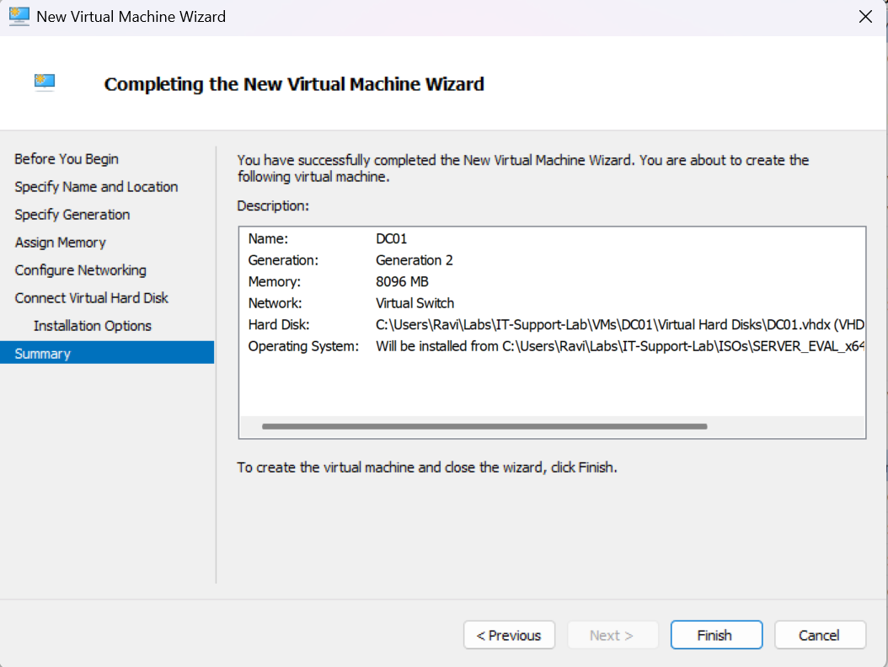

---

## 2️⃣ Installed Windows Server 2022

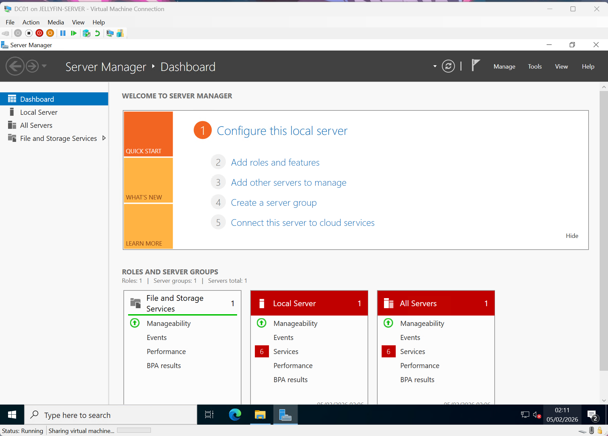

---

## 3️⃣ Renamed Server to DC01

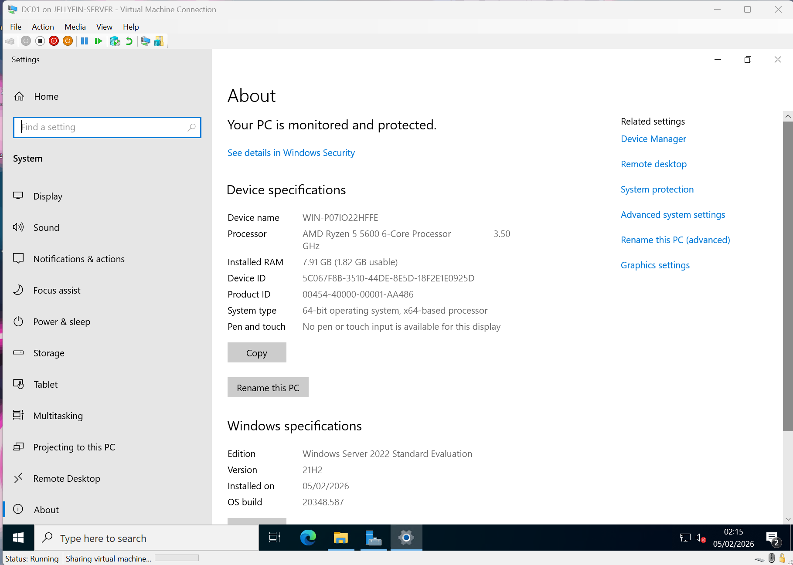
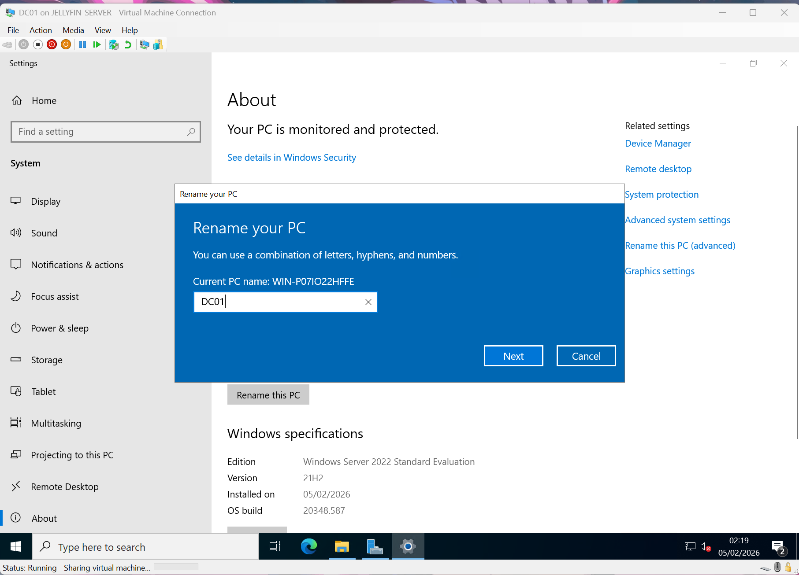
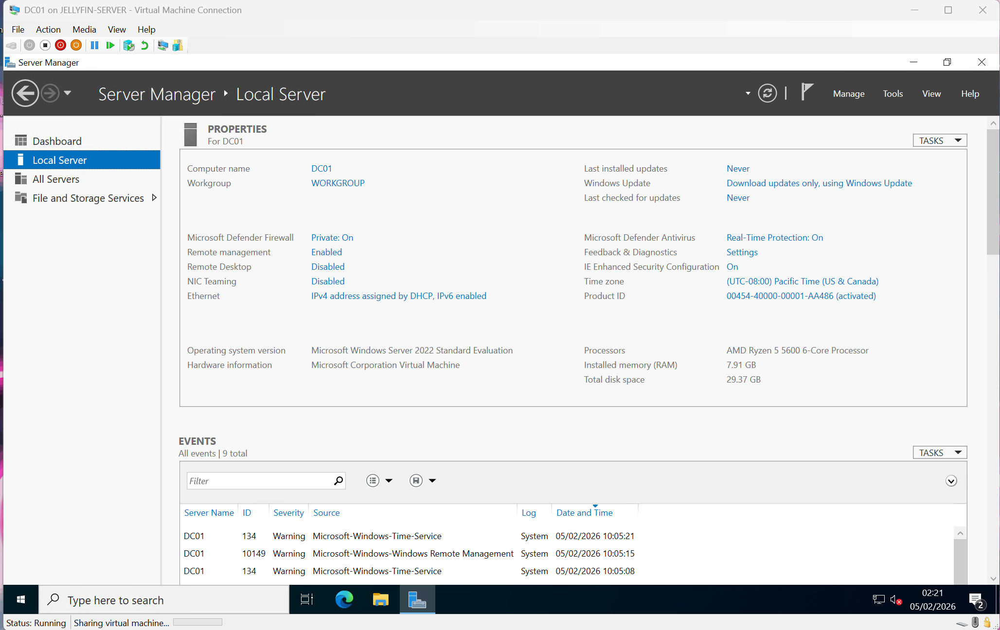

---

## 4️⃣ Configured Static IP Address

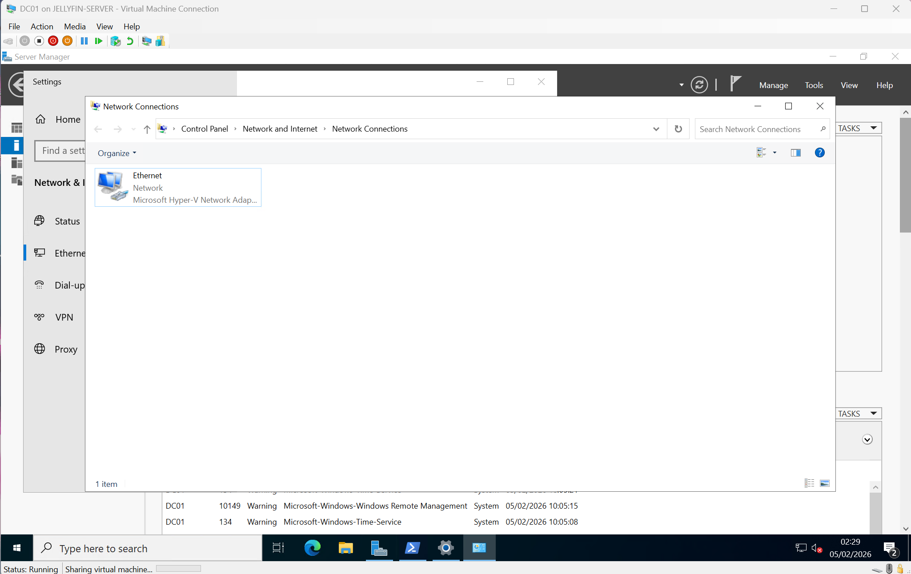
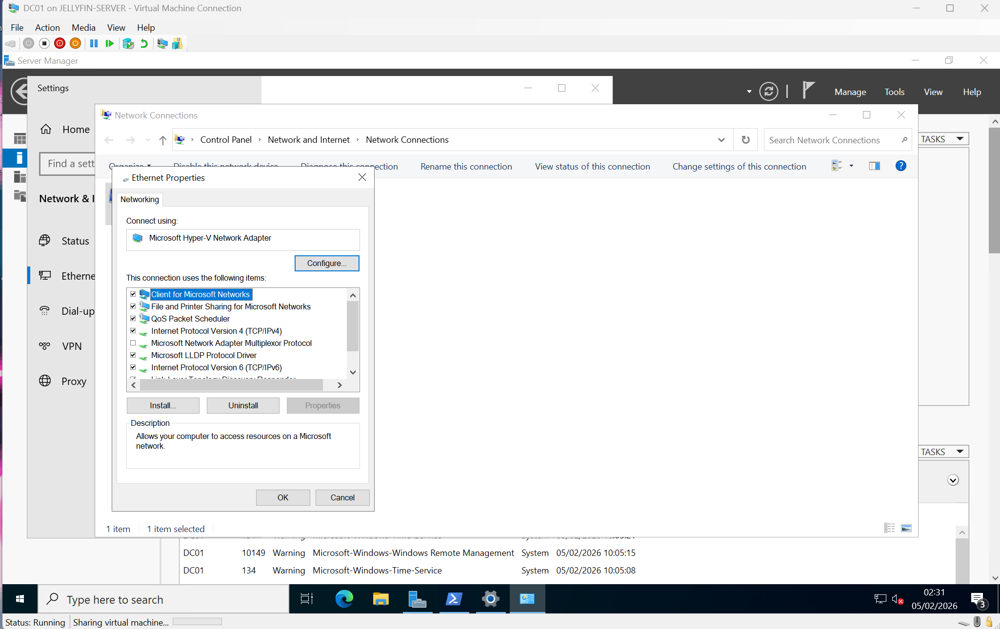
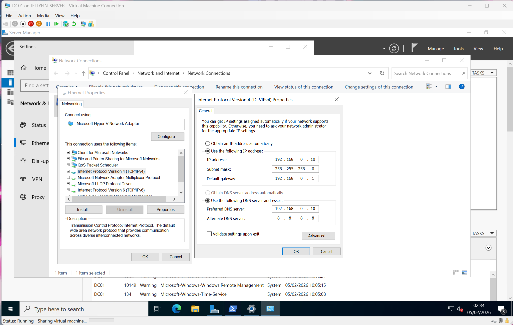

---

## 5️⃣ Installed Active Directory Domain Services Role

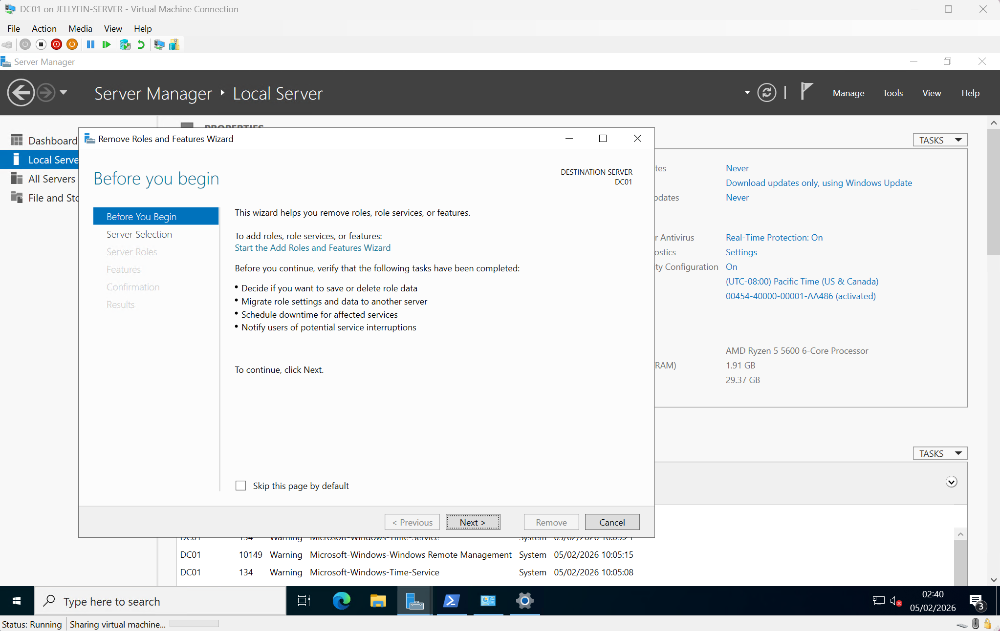
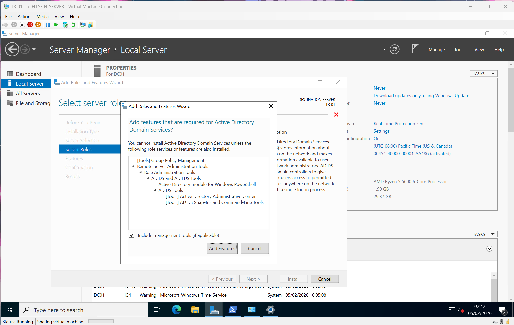
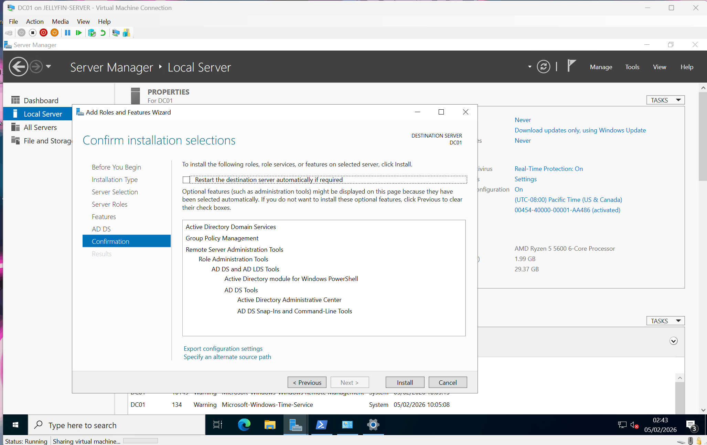
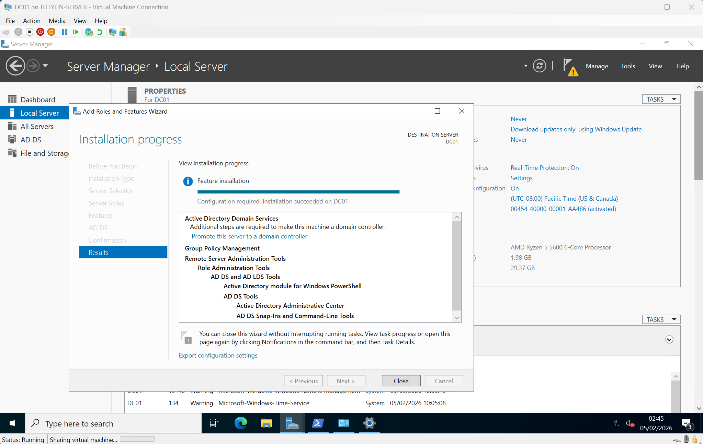

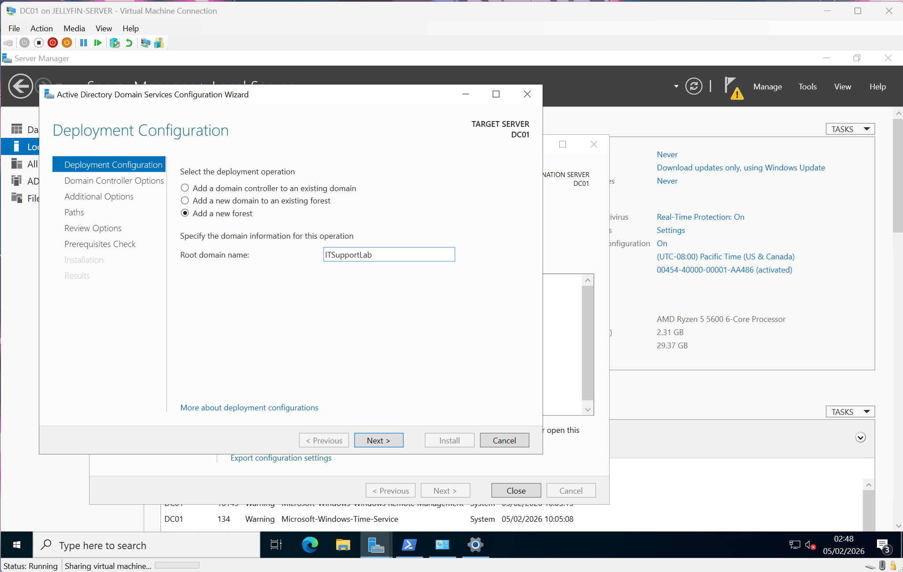
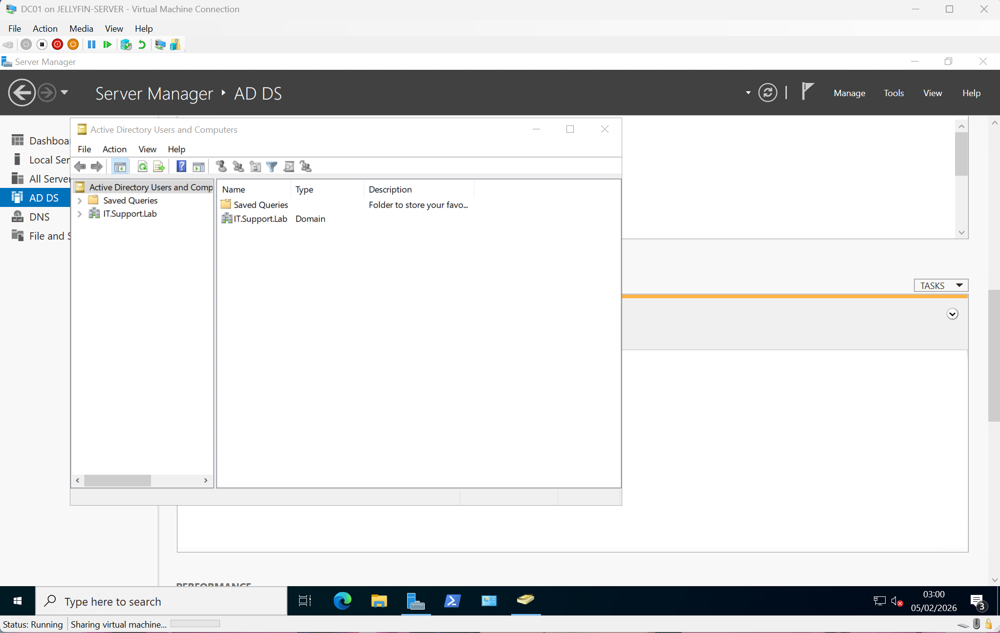

---

# ✅ Verification

After promotion:

- Confirmed domain IT.Support.Lab created
- Verified Forward Lookup Zone in DNS Manager
- Confirmed static IP via `ipconfig /all`
- Confirmed DNS server points to 192.168.0.10
- Confirmed domain visible in Active Directory Users and Computers

---

# 🧠 What This Simulates

This lab mirrors real 1st Line IT Support tasks such as:

- Domain Controller deployment
- Static IP troubleshooting
- AD role installation
- DNS validation
- Basic infrastructure configuration

---

# 🚀 Outcome

A fully operational Active Directory Domain Controller has been successfully deployed.

This environment will be used for future labs involving:

- User account management
- Password resets
- Account lockouts
- Group Policy
- File share permissions
- Microsoft 365 hybrid scenarios
