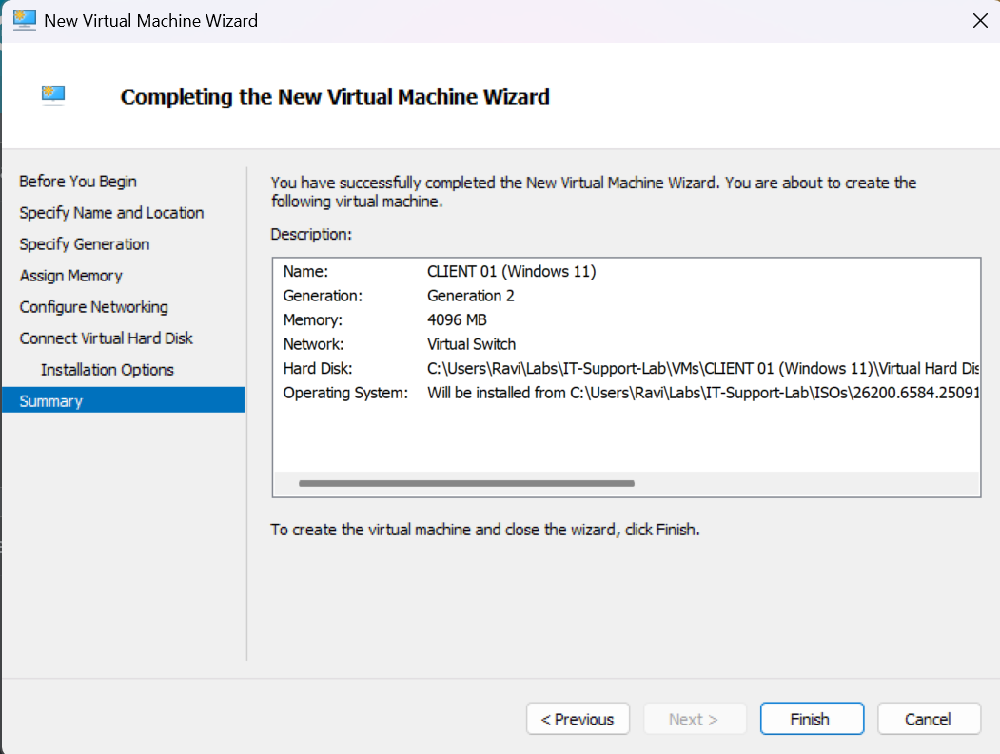
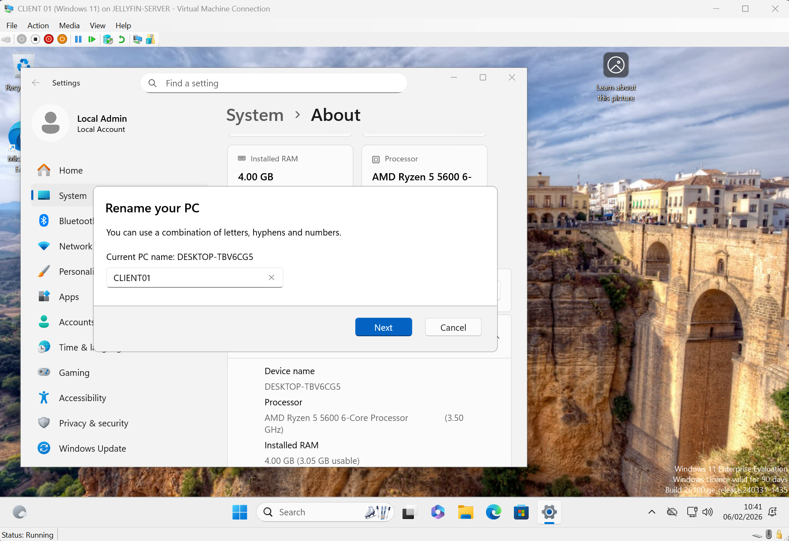
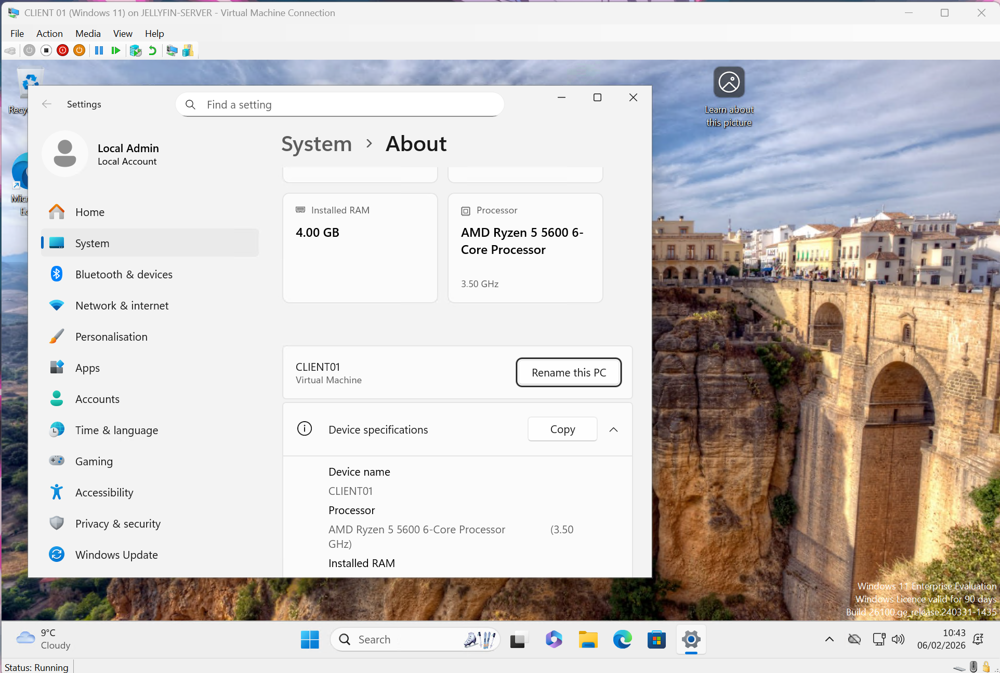
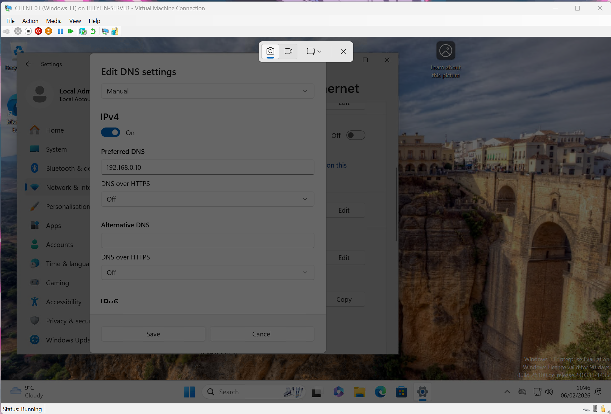
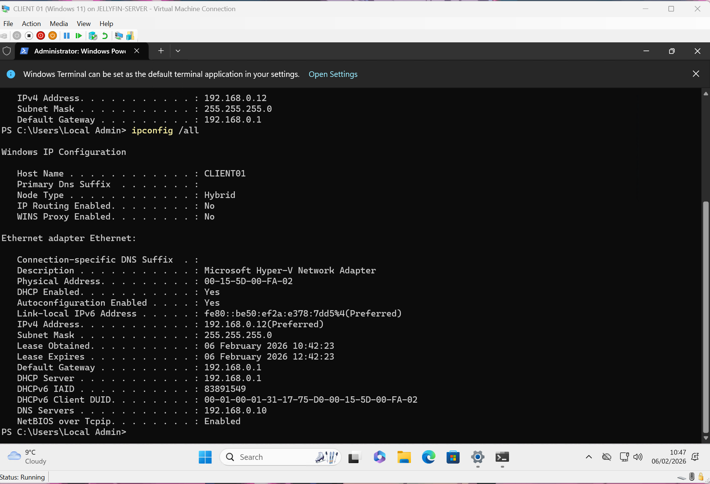
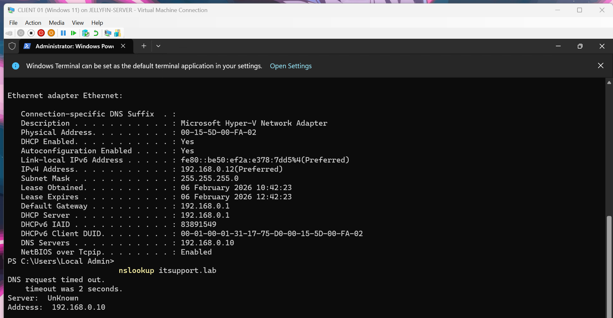
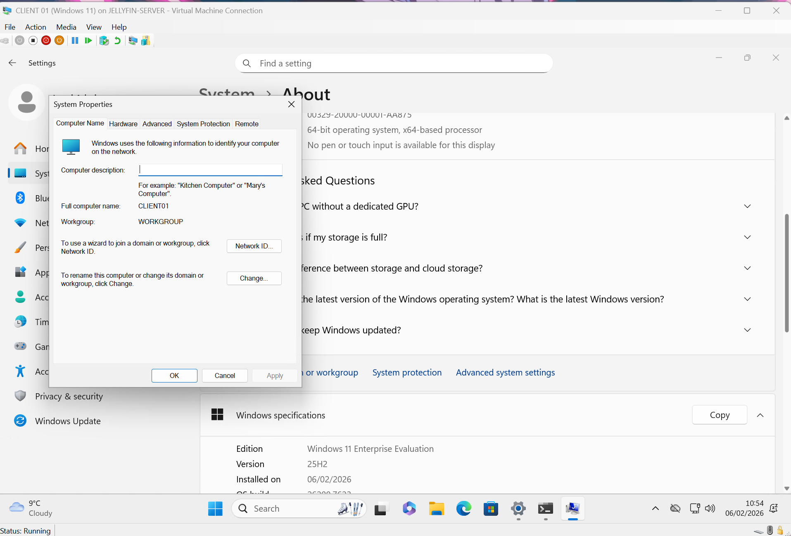
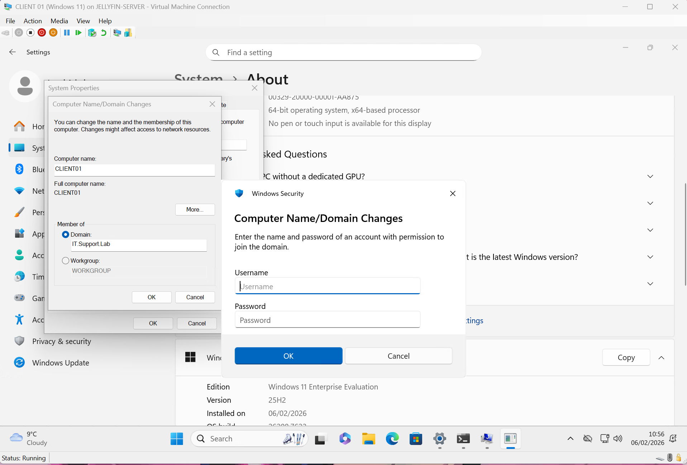
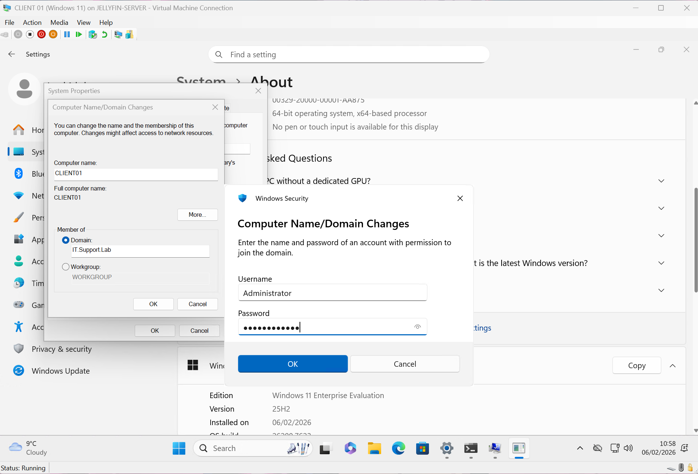
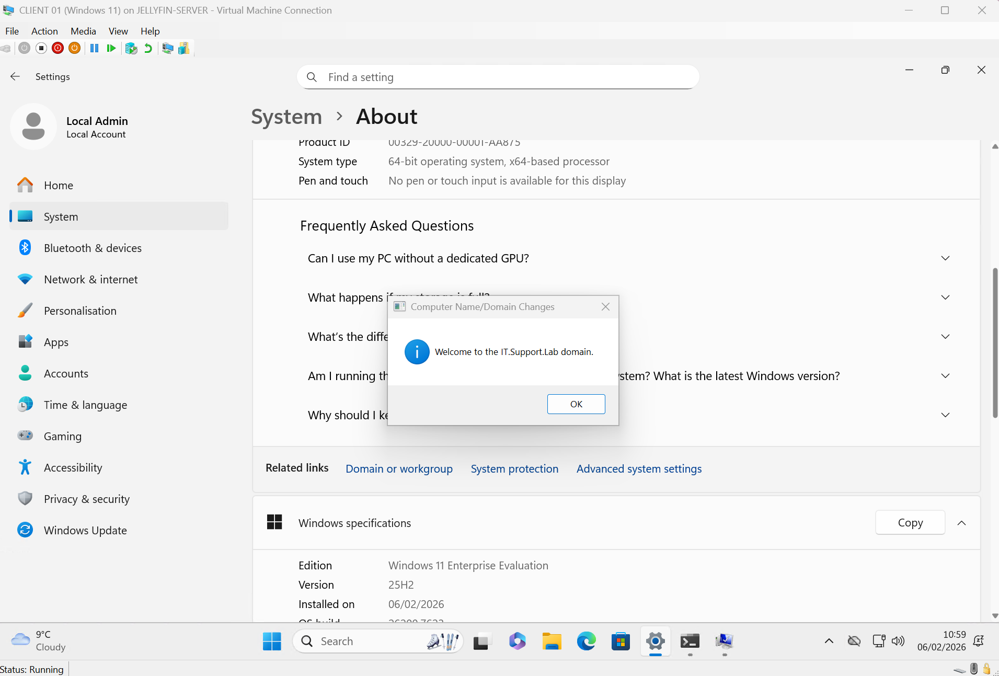

# Day 02 – Windows 11 Client Deployment & Domain Join

## 🎯 Objective

Deploy a Windows 11 client virtual machine and join it to the Active Directory domain created on Day 01.

This simulates a real-world 1st Line IT task of onboarding a workstation into a corporate environment.

---

## 🖥️ Environment

- Hypervisor: Hyper-V
- Client OS: Windows 11
- Machine Name: CLIENT01
- Domain: ITSUPPORT.LAB
- Domain Controller IP: 192.168.0.10
- DNS Server: 192.168.0.10

---

## 🔧 Steps Performed

### 1️⃣ Created Windows 11 VM

---

### 2️⃣ Renamed Machine to CLIENT01

---

### 3️⃣ Configured DNS to Point to Domain Controller

---

### 4️⃣ Verified DNS Resolution

---

### 5️⃣ Joined Machine to Domain

---

### 6️⃣ Confirmed Successful Domain Join

---

## ✅ Verification

- Successfully authenticated using domain credentials
- Machine visible in Active Directory Users and Computers
- DNS resolution confirmed
- Domain trust established

---

## 🧠 What This Simulates

- Workstation onboarding
- DNS troubleshooting
- Domain authentication
- Corporate endpoint configuration

---

## 📌 Outcome

CLIENT01 is now successfully joined to the ITSUPPORT.LAB domain and fully integrated into the lab environment.
