# Day 04 – Account Lockout Policy (Default Domain Policy)

## 🎯 Objective

To configure and test the **Account Lockout Policy** within the Default Domain Policy, simulate a user lockout, and resolve the issue using Active Directory.

This lab demonstrates:
- GPO configuration
- Policy enforcement
- gpupdate usage
- Account lockout simulation
- Helpdesk-style troubleshooting and resolution

---

## 🧱 Environment

- **Domain Controller:** DC01  
- **Client Machine:** CLIENT01 (Windows 11)  
- **Domain:** IT.Support.Lab  
- **Test User:** Floyd Mayweather  

---

# 🔐 1️⃣ Configure Account Lockout Policy

The Account Lockout Policy was configured in:

- Default Domain Policy
- → Computer Configuration
- → Policies
- → Windows Settings
- → Security Settings
- → Account Policies
- → Account Lockout Policy

### Settings Configured:

- Account lockout threshold: 3 invalid attempts
- Account lockout duration: 15 minutes
- Reset account lockout counter after: 15 minutes

---

### 📸 Screenshots

#### 1-Configure-Account-Lockout-Policy-1
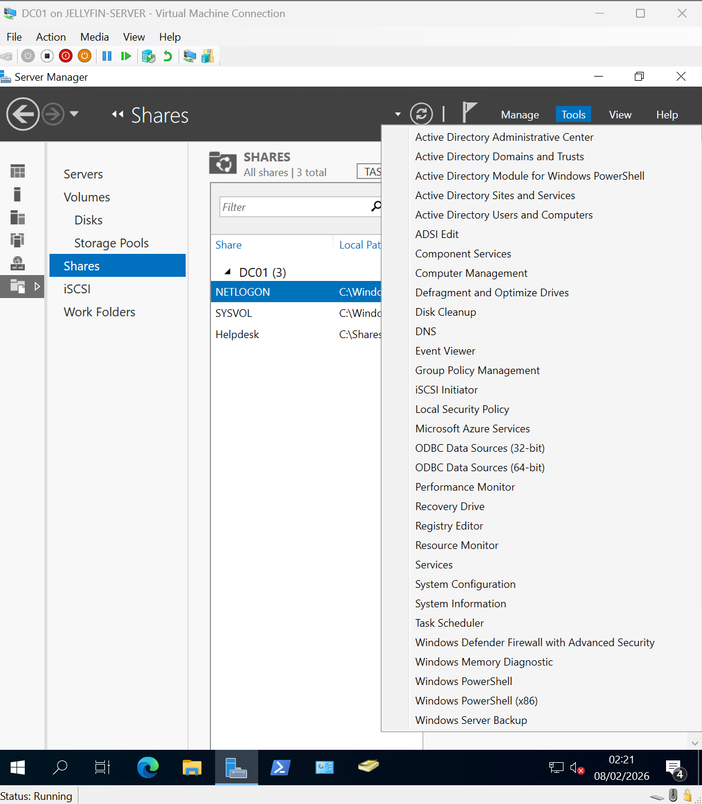

#### 1-Configure-Account-Lockout-Policy-2
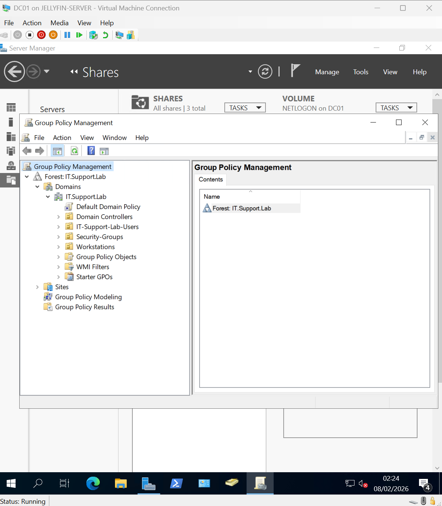

#### 1-Configure-Account-Lockout-Policy-3
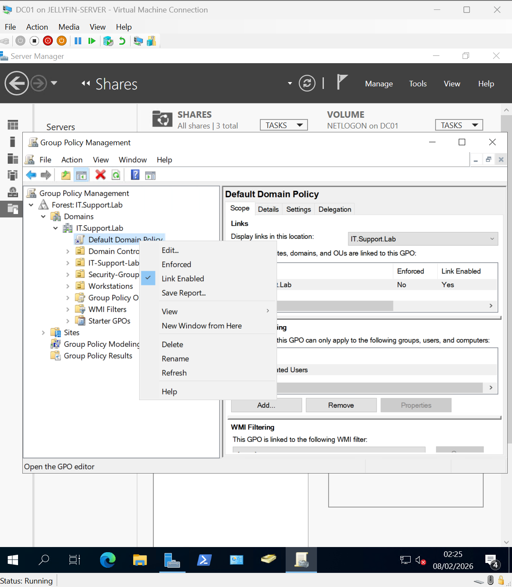

#### 1-Configure-Account-Lockout-Policy-4
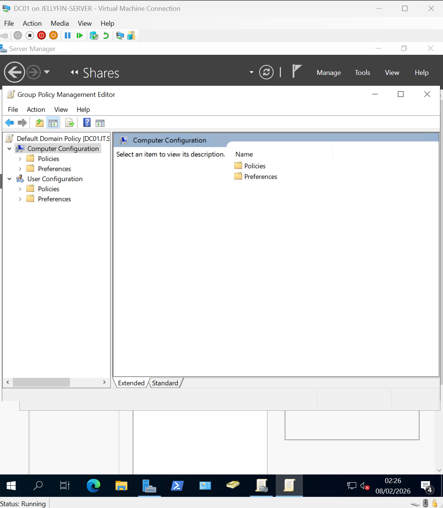

#### 1-Configure-Account-Lockout-Policy-5
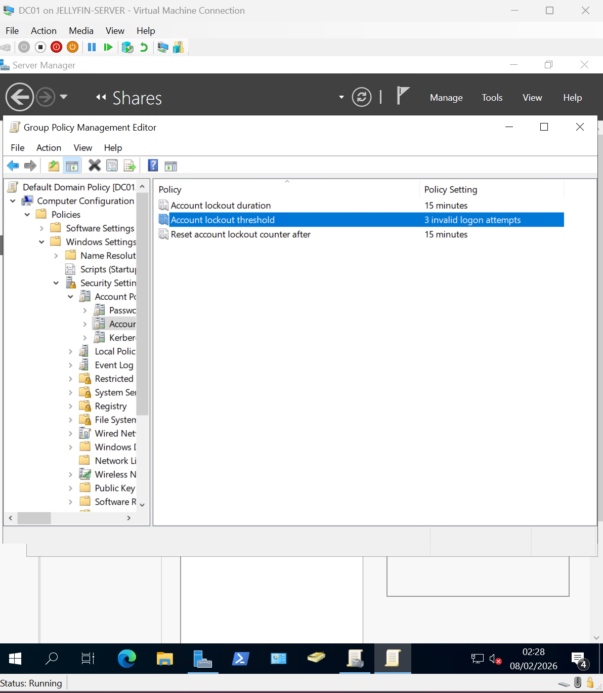

---

# 🔄 2️⃣ Force Group Policy Update

After configuring the policy, Group Policy was updated on:

- DC01
- CLIENT01

Using:

gpupdate /force

---

### 📸 Screenshots

#### 2-gpupdate-force-DC01-1
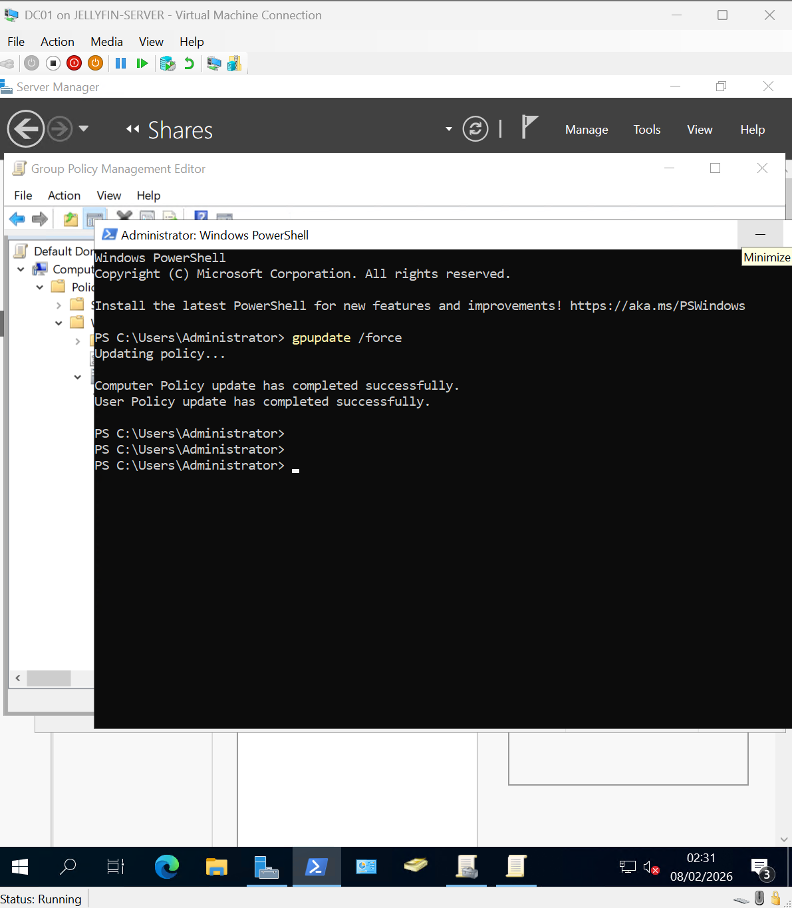

#### 2-gpupdate-force-CLIENT01-2
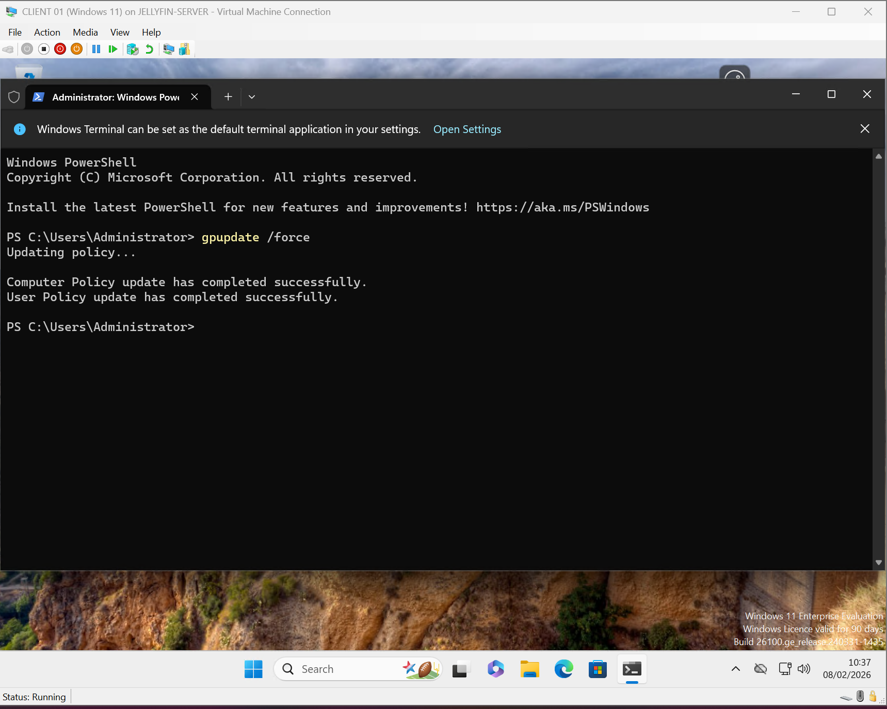

---

# ✅ 3️⃣ Verify Policy Application

Policy settings were verified on the client using:

net accounts

This confirmed:
- Lockout threshold: 3
- Lockout duration: 15 minutes
- Observation window: 15 minutes

---

### 📸 Screenshot

#### 2-Policy-Check-Applied-3
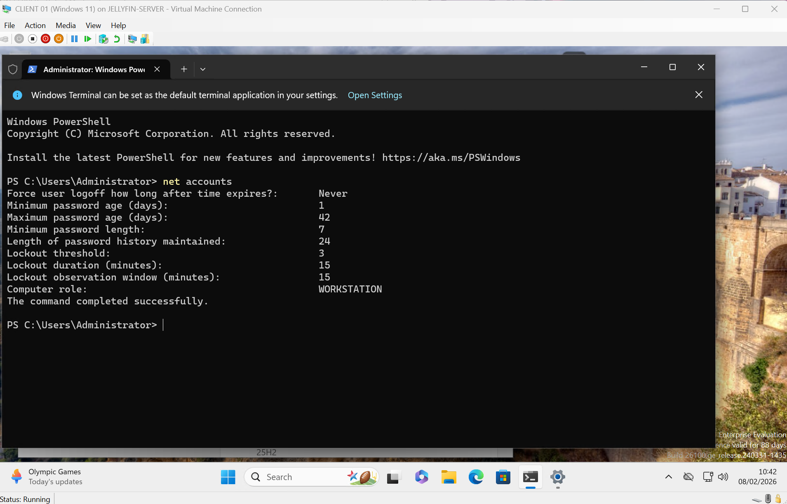

---

# 🚨 4️⃣ Simulate Account Lockout

User: **Floyd Mayweather**

Incorrect password was entered 3 times to trigger the lockout.

Result:
- Account was locked
- Login denied
- Error message displayed:  
  *"The referenced account is currently locked out and may not be logged on to."*

---

### 📸 Screenshot

#### 3-Account-Lockout-Simulation-1
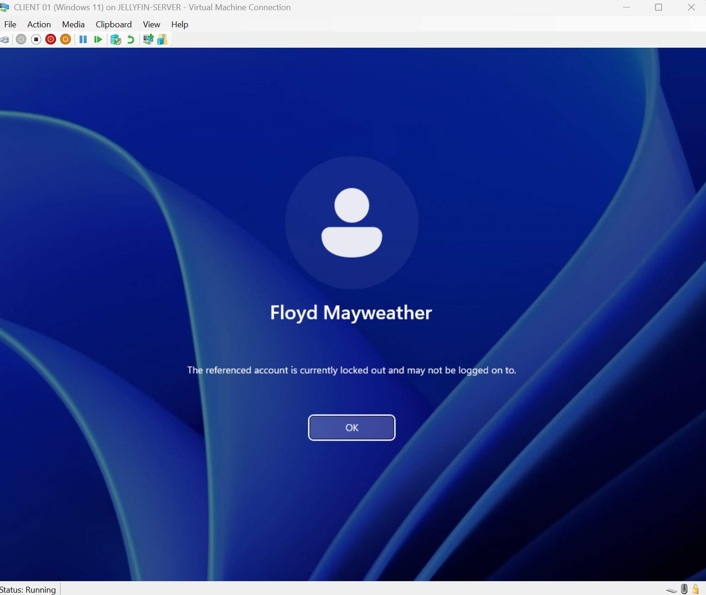

---

# 🛠️ 5️⃣ Helpdesk Resolution – Unlock Account

Resolution performed on DC01:

Active Directory Users and Computers
- → Floyd Mayweather
- → Properties
- → Account Tab
- → Unlock Account

---

### 📸 Screenshot

#### 3-Unlock-Account-In-Active-Directory-2
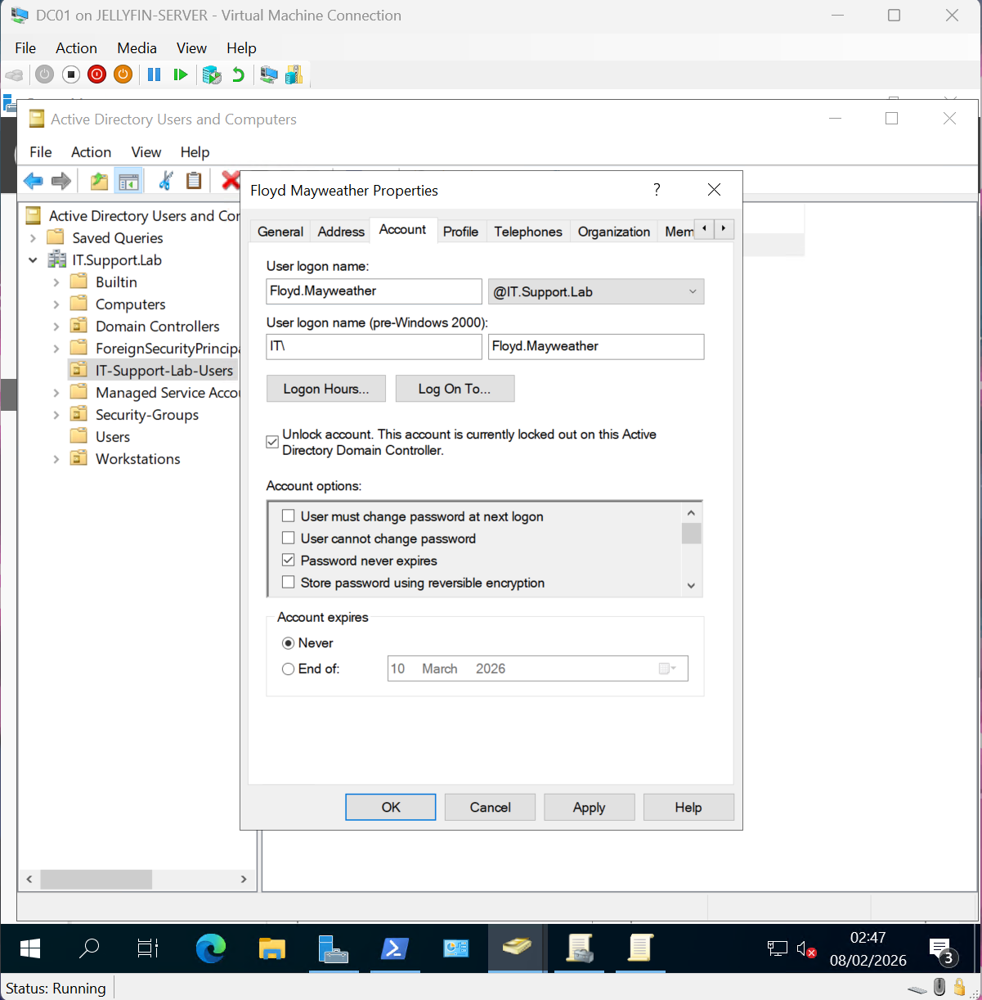

---

# 🔓 6️⃣ Verify Successful Login

After unlocking:

- User logged back into CLIENT01
- Access restored successfully

---

### 📸 Screenshots

#### 3-Verify-User-Can-Logon-3
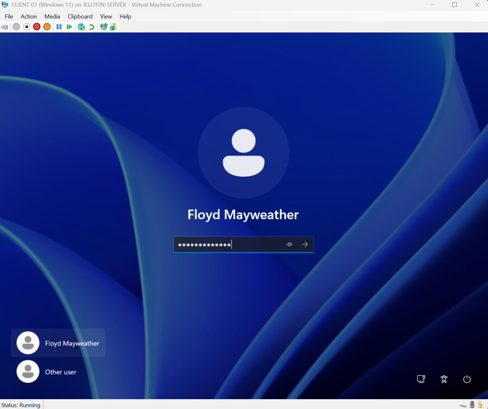

#### 3-User-Can-Log-back-in-4
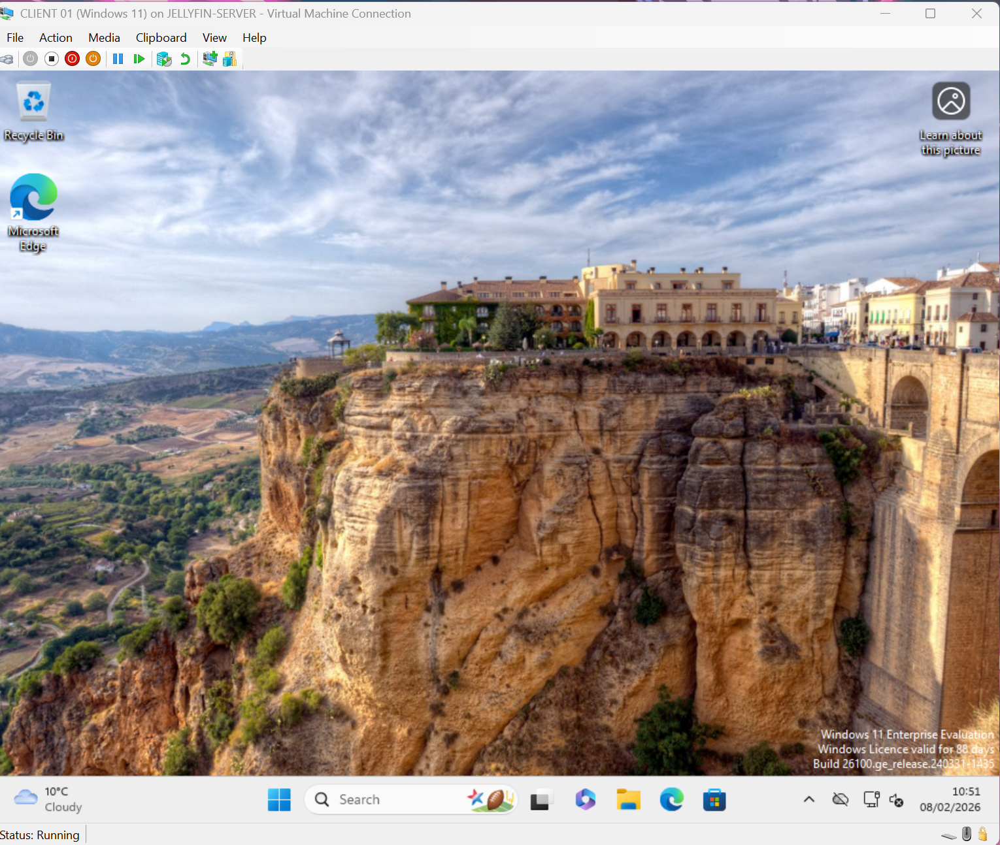

---

# 🧠 Skills Demonstrated

- Group Policy configuration
- Domain-level security enforcement
- gpupdate usage
- Policy verification via CLI
- Active Directory account management
- Helpdesk-style troubleshooting workflow
- Account unlock procedure

---

# 🏁 Outcome

The Account Lockout Policy was successfully:

✔ Configured  
✔ Applied  
✔ Verified  
✔ Triggered  
✔ Resolved  

This lab replicates a real-world helpdesk scenario involving user account lockouts within an Active Directory domain environment.

---

