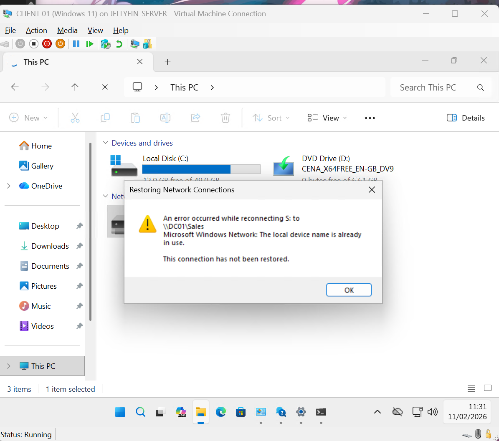
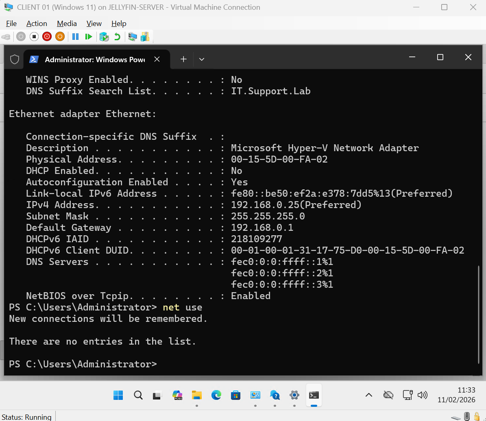
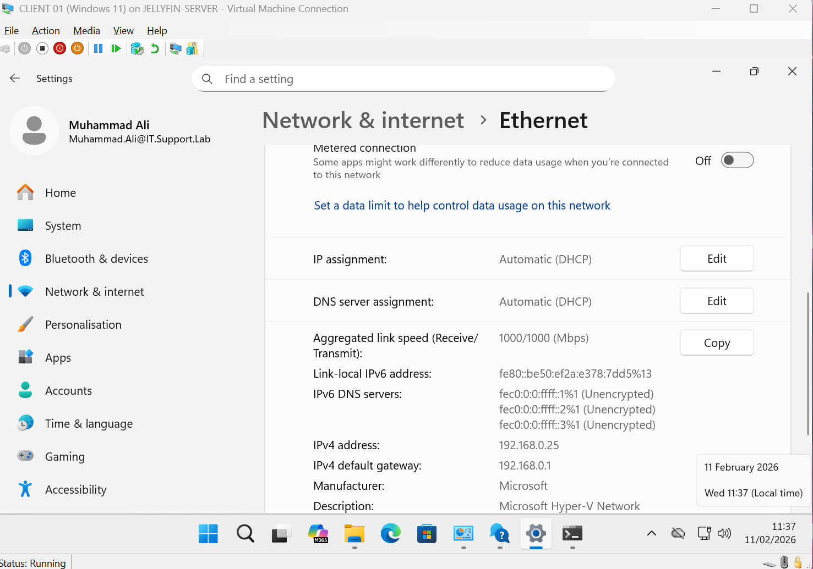
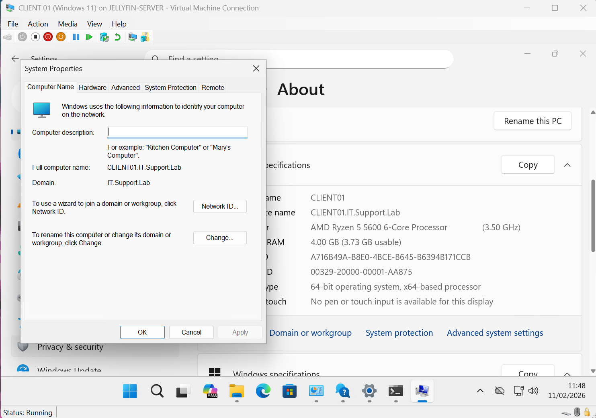
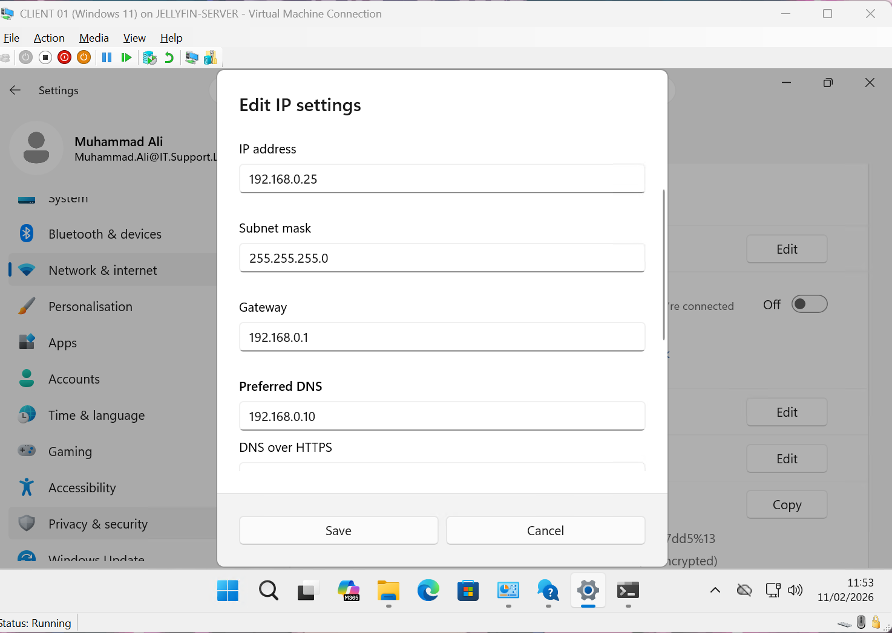
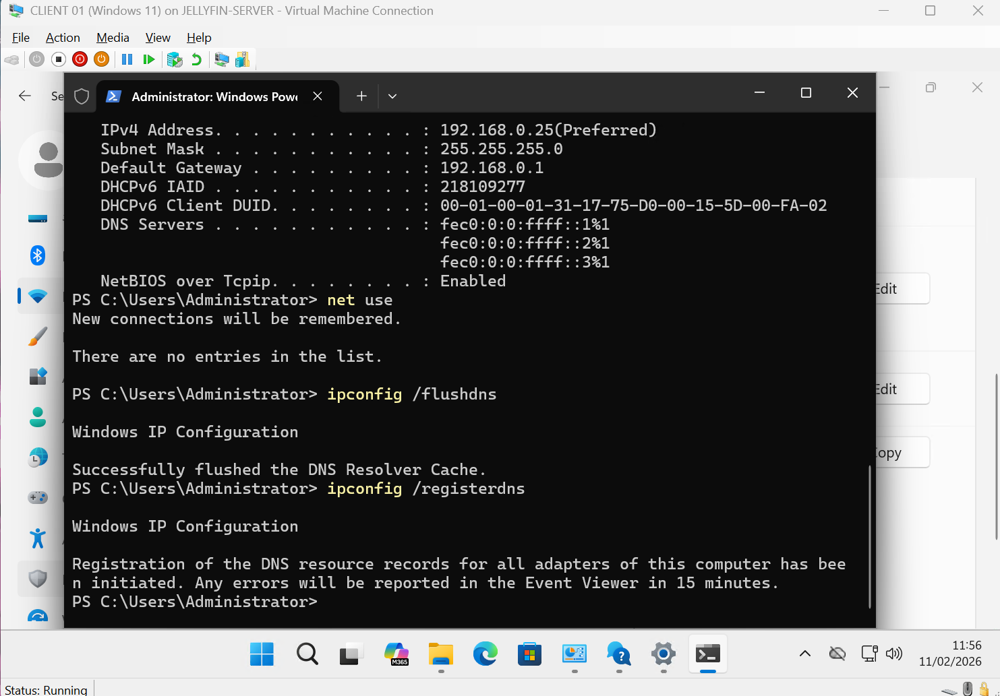
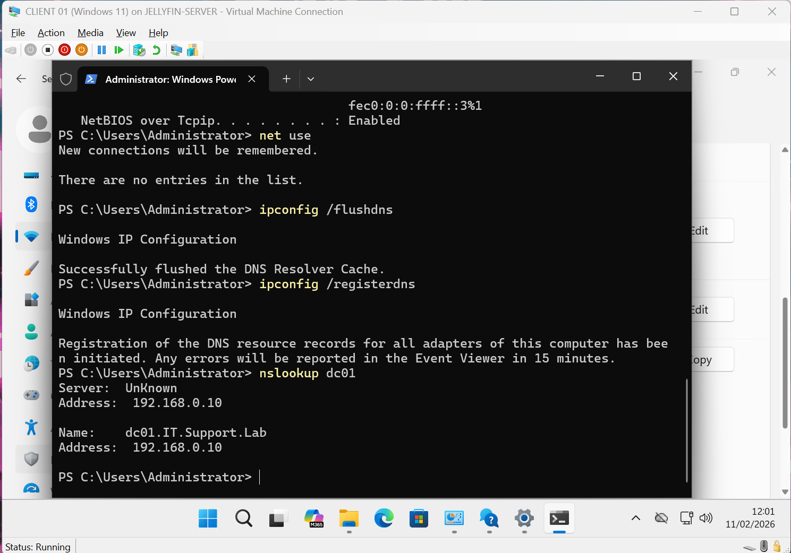
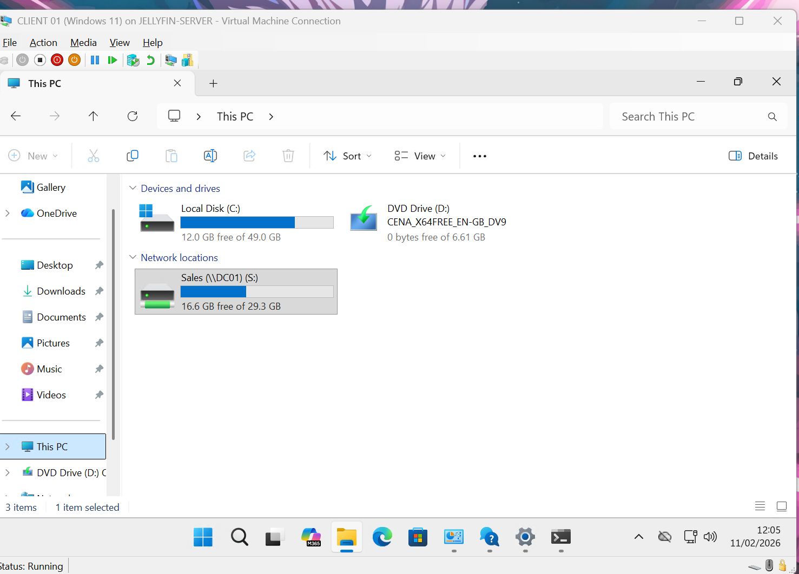

# Day 07 – AD DNS Misconfiguration & Drive Mapping Failure (Root Cause Analysis)

## 🧾 Executive Summary

A mapped network drive failure occurred on CLIENT01 within the IT.Support.Lab domain environment.

- Investigation revealed that DNS configuration was incorrectly assigned via router-based DHCP instead of the Domain Controller.

- The issue was traced back to a Hyper-V virtual switch re-binding event following a physical switch relocation.

- Correcting the DNS configuration restored full domain functionality and drive access.

---

## 🧠 Objective

Simulate a real-world Helpdesk incident involving:

- Mapped network drive failure  
- DNS misconfiguration in an Active Directory environment  
- DHCP behaviour analysis  
- Hyper-V virtual switch troubleshooting  
- Root cause identification and documentation  

This lab demonstrates real-world troubleshooting methodology in a domain environment.

---

## 🏗 Lab Environment

**Domain:** IT.Support.Lab  
**Domain Controller:** DC01 (192.168.0.10)  
**Client Machine:** CLIENT01  
**Virtualization:** Hyper-V (External Virtual Switch)  
**Physical Network Device:** Cisco 2960 Switch  

---

## 🚨 Incident Overview

User **Muhammad Ali (Sales)** reported inability to access the mapped Sales drive (S:).

Error displayed:

> “The local device name is already in use.  
> This connection has not been restored.”

---

# 🔍 Step 1 – User Reported Error

Ali attempted to access the Sales drive and received an error.

---

# 🔎 Step 2 – Initial Troubleshooting

Performed basic network checks:

- `ipconfig`
- `net use`

No mapped drives were actively listed.

---

# 🧠 Step 3 – Identifying DNS Misconfiguration

`ipconfig` revealed the client was receiving DNS via DHCP.

The DNS server was not set to the Domain Controller (192.168.0.10).

Instead, DNS was being assigned by the router.

⚠️ In Active Directory environments, clients must use the Domain Controller as their DNS server.

---

# 🖥 Step 4 – Verifying Domain Membership

Checked whether CLIENT01 had fallen off the domain.

Result: Machine was still joined to the domain.

Domain Status: ✅ Joined  
DNS Configuration: ❌ Incorrect  

---

# 🛠 Step 5 – Manual IP & DNS Assignment

Manually configured network settings:

- IP Address: 192.168.0.25  
- Subnet Mask: 255.255.255.0  
- Default Gateway: 192.168.0.1  
- Preferred DNS: 192.168.0.10  

---

# 🔄 Step 6 – Flush & Re-Register DNS

Executed:

`ipconfig /flushdns`
`ipconfig /registerdns`

This cleared cached records and forced DNS re-registration with the Domain Controller.

---

# 🌐 Step 7 – Validating DNS Resolution

Tested DNS resolution using:

`nslookup dc01`

Result:

- dc01.IT.Support.Lab resolved successfully  
- IP returned: 192.168.0.10  

DNS was now correctly resolving through the Domain Controller.

---

# ✅ Step 8 – Drive Access Restored

After correcting DNS configuration, the Sales drive (S:) was accessible again.

Drive mapping successfully restored.

---

# 🧩 Root Cause Analysis

## What Happened

1. Cisco 2960 switch was unplugged during lab relocation.
2. Hyper-V External Virtual Switch automatically defaulted to Wi-Fi NIC.
3. Wi-Fi network used router-based DHCP.
4. Router assigned itself as DNS server.
5. Client stopped using DC01 for DNS resolution.
6. Active Directory name resolution failed.
7. Mapped drive restoration failed.

---

# 🧠 Key Technical Concepts Demonstrated

- Active Directory DNS Dependency  
- DHCP vs Static DNS Configuration  
- Hyper-V External Switch Behaviour  
- Name Resolution in Domain Environments  
- Drive Mapping Dependency on Proper DNS  
- Root Cause Analysis Documentation  

---

# 📊 Commands Used

`ipconfig`
`net use`
`ipconfig /flushdns`
`ipconfig /registerdns`
`nslookup dc01`
`ping dc01`

---

# 🏁 Outcome

The issue was successfully resolved by:

- Identifying incorrect DNS assignment
- Manually assigning Domain Controller DNS
- Flushing and re-registering DNS records
- Validating name resolution
- Confirming drive mapping restoration

This lab simulates a realistic Helpdesk / Junior Sysadmin incident involving Active Directory dependency on proper DNS configuration.

---

## 💼 Portfolio Value

This scenario demonstrates:

- Structured troubleshooting methodology  
- Understanding of AD DNS architecture  
- Virtual switch networking awareness  
- DHCP behaviour analysis  
- Infrastructure change impact analysis  
- Clear root cause documentation  

Incident Resolved ✅  
DNS Corrected ✅  
Drive Mapping Restored ✅  
Root Cause Documented ✅
