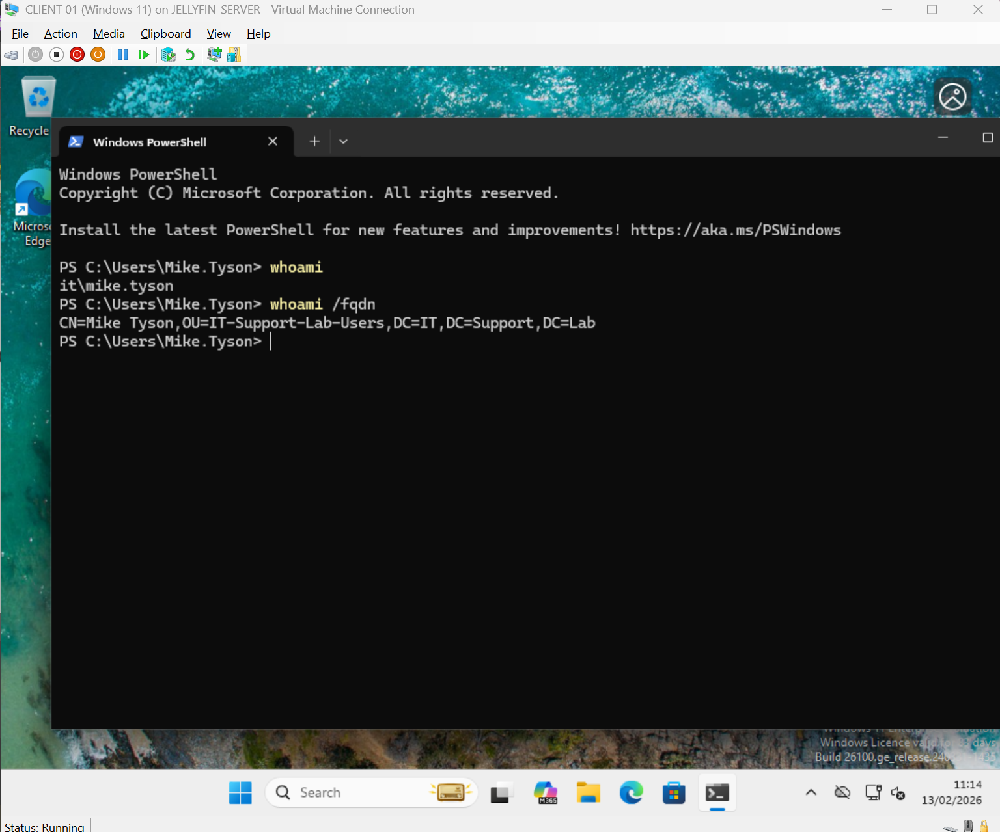
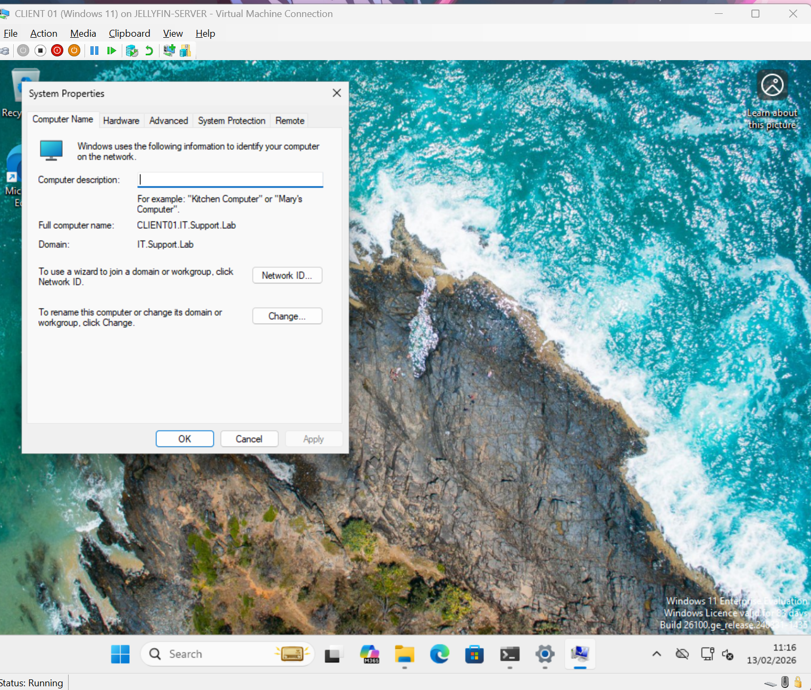
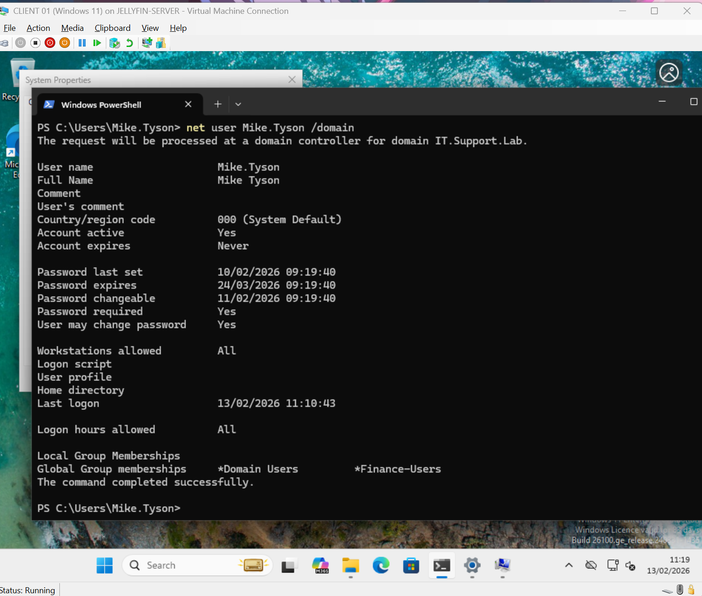
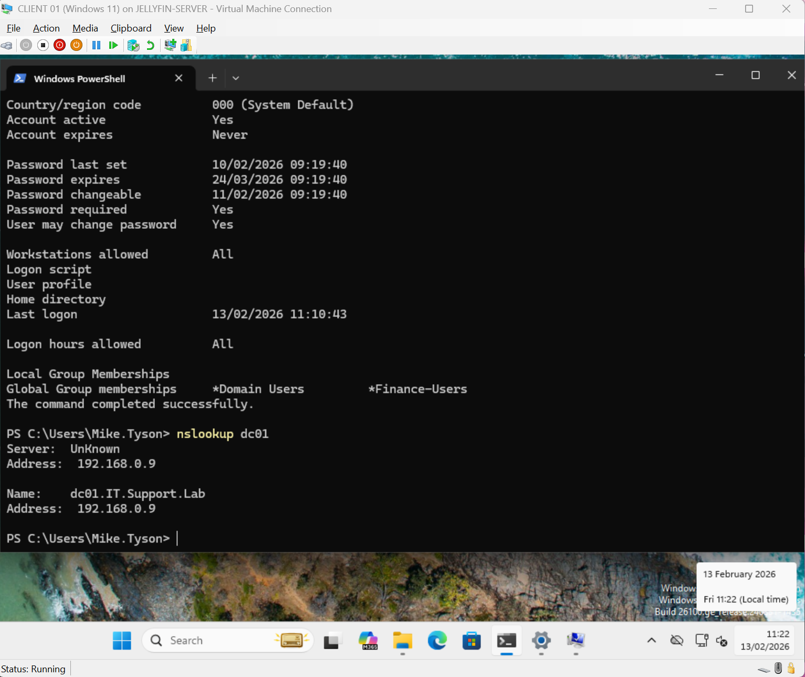
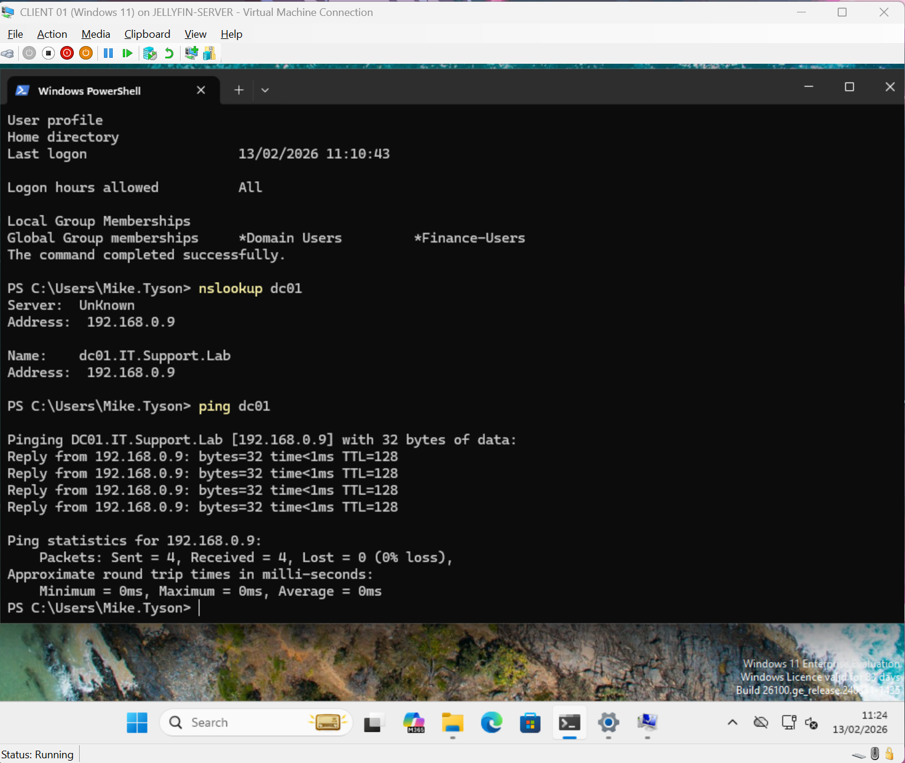
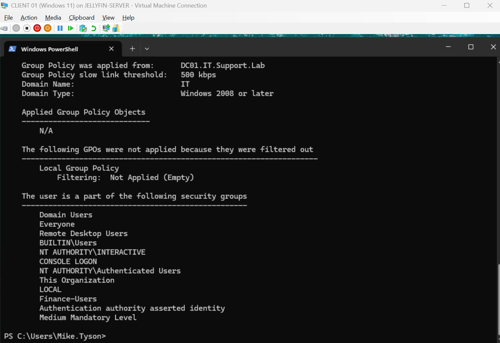
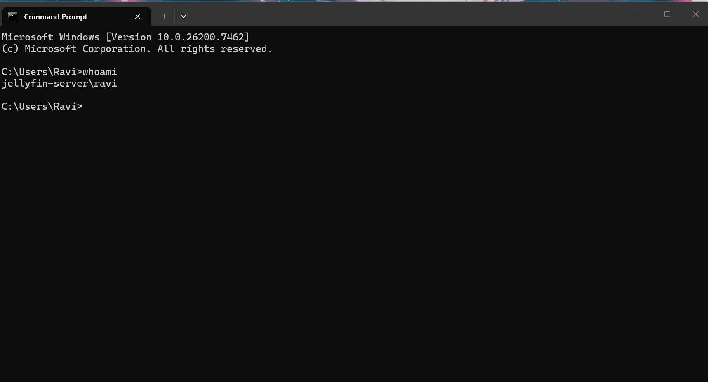

# Day 09 – Helpdesk Endpoint Validation Flow (Domain Login + Finance Drive Access)

---

## 🧠 Objective

Validate that **Mike Tyson (Finance)** can:

- Log in successfully using a **domain account**

- Confirm the endpoint is **domain-joined**

- Verify **DNS + Domain Controller connectivity**

- Confirm **Group Policy** applies correctly

- Prove the endpoint is healthy after prior infrastructure changes

This mirrors a real Helpdesk **post-incident validatio** workflow after an authentication  drive-mapping issue.

---

## 🏗 Lab Environment

- **Domain:** IT.Support.Lab  

- **Domain Controller:** DC01 (192.168.0.10)  

- **User:** IT.Support.Lab\\Mike.Tyson (Finance)  

- **Client:** CLIENT01 (Windows 11)  

- **Context:** User can log in + has Finance drive access ✅

---

## ✅ Validation Steps (Helpdesk Flow)

### 🔍 Step 1 – Identify the Current User

**Command used:**

- `whoami`

**Purpose:**

- Confirm the active user session

- Validate correct account context

**Expected Result:**

- `it.support.lab\\mike.tyson`

**Screenshot:**

!\[1-Identify-The-Current-User](screenshots/1-Identify-The-Current-User.png)

---

### 🔐 Step 2 – Confirm Authentication Type (Domain vs Local)

**Command used:**

- `whoami /fqdn`

**Purpose:**

- Validate domain-based authentication (Kerberos)

- Confirm user is authenticated against AD services

**Screenshot:**

---

### 🖥 Step 3 – GUI Domain Confirmation

**Verification path:**

- This PC → Properties → Domain or Workgroup

**Purpose:**

- Confirm machine is domain joined

- Validate endpoint management status

**Expected Result:**

- **Domain:** IT.Support.Lab

**Screenshot:**

---

### 🧾 Step 4 – Command-Line Domain Check

**Command used:**

- `systeminfo | findstr /B /C:"Domain"`

**Purpose:**

- Confirm domain membership via CLI

- Demonstrate an alternate validation method used in Helpdesk workflows

**Screenshot:**

---

### 🌐 Step 5 – Check DNS Resolution

**Command used:**

- `nslookup dc01`

**Purpose:**

- Verify DNS resolution is working correctly

- Ensure domain services can be located

**Expected Result:**

- `dc01.IT.Support.Lab → 192.168.0.10`

**Screenshot:**

---

### 📡 Step 6 – Check Domain Controller Reachability

**Command used:**

- `ping dc01`

**Purpose:**

- Confirm network path to Domain Controller

- Validate basic connectivity

**Screenshot:**

---

### 🏢 Step 7 – Group Policy Verification

\*\*Command used:\*\*

- `gpresult /r`

**Purpose:**

- Confirm Group Policy is applying successfully

- Validate the machine is managed by domain policies

**Screenshot 1:**

**Screenshot 2:**

---

### 👤 Step 8 – Local Account Comparison (Awareness Check)

**Purpose:**

- Demonstrate the difference between local and domain authentication

- Helpdesk awareness check when diagnosing login / policy / access issues

**Validation:**

- Confirm account context is **domain-based**, not local

**Screenshot:**

---

## 🧠 Key Concepts Practiced

- Domain vs Local Account Identification

- Kerberos Authentication Validation

- Active Directory DNS Dependency

- Domain Membership Verification (CLI + GUI)

- Domain Controller Connectivity Testing

- Group Policy Validation

- Endpoint Health Verification Workflow

- Helpdesk Post-Incident Validation Process

---

\## 🧩 Commands Used

\- `whoami`

\- `whoami /fqdn`

\- `systeminfo | findstr /B /C:"Domain"`

\- `nslookup dc01`

\- `ping dc01`

\- `gpresult /r`

---

\## 🏁 Outcome

Helpdesk validation confirmed:

\- User logged in with \*\*domain credentials\*\*

\- Machine correctly joined to \*\*IT.Support.Lab\*\*

\- DNS resolving through \*\*Domain Controller\*\*

\- Domain Controller reachable

\- Group Policy applied successfully

\- Endpoint functioning as expected

\*\*Endpoint Status:\*\* ✅ Healthy  

\*\*Domain Authentication:\*\* ✅ Verified  

\*\*DNS Resolution:\*\* ✅ Operational  

\*\*Policies Applied:\*\* ✅ Confirmed  

---

\## 💼 Helpdesk Portfolio Value

This lab demonstrates practical Helpdesk skills including:

\- Endpoint verification methodology

\- Active Directory environment validation

\- Structured validation checks (post-incident)

\- Multi-layer verification (GUI + CLI)

\- Domain authentication awareness

\- Professional ticket closure workflow

\*\*Lab Completed:\*\* Day 09  

\*\*Focus Area:\*\* Helpdesk Endpoint Validation \& Domain Health Check

