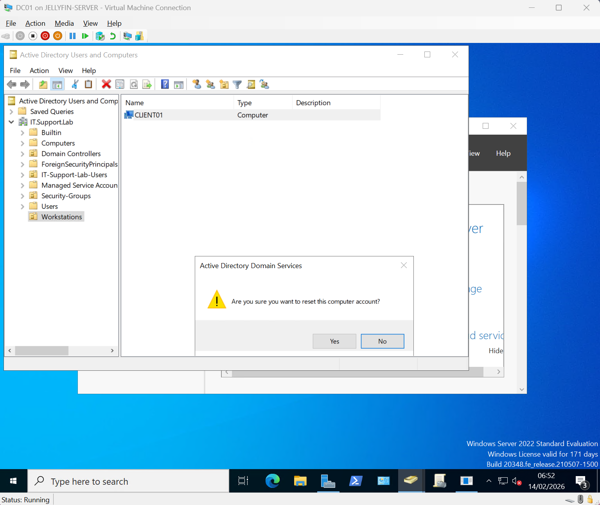
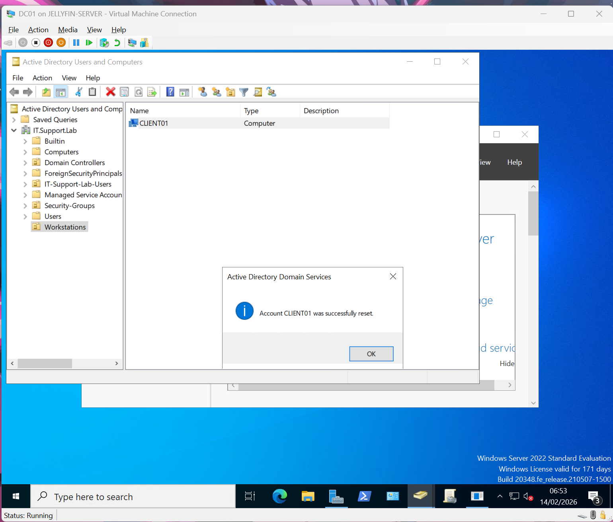
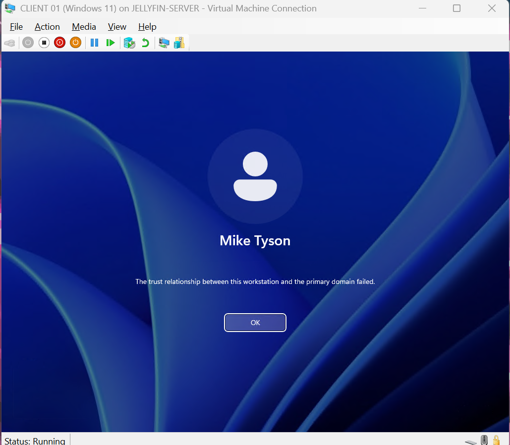
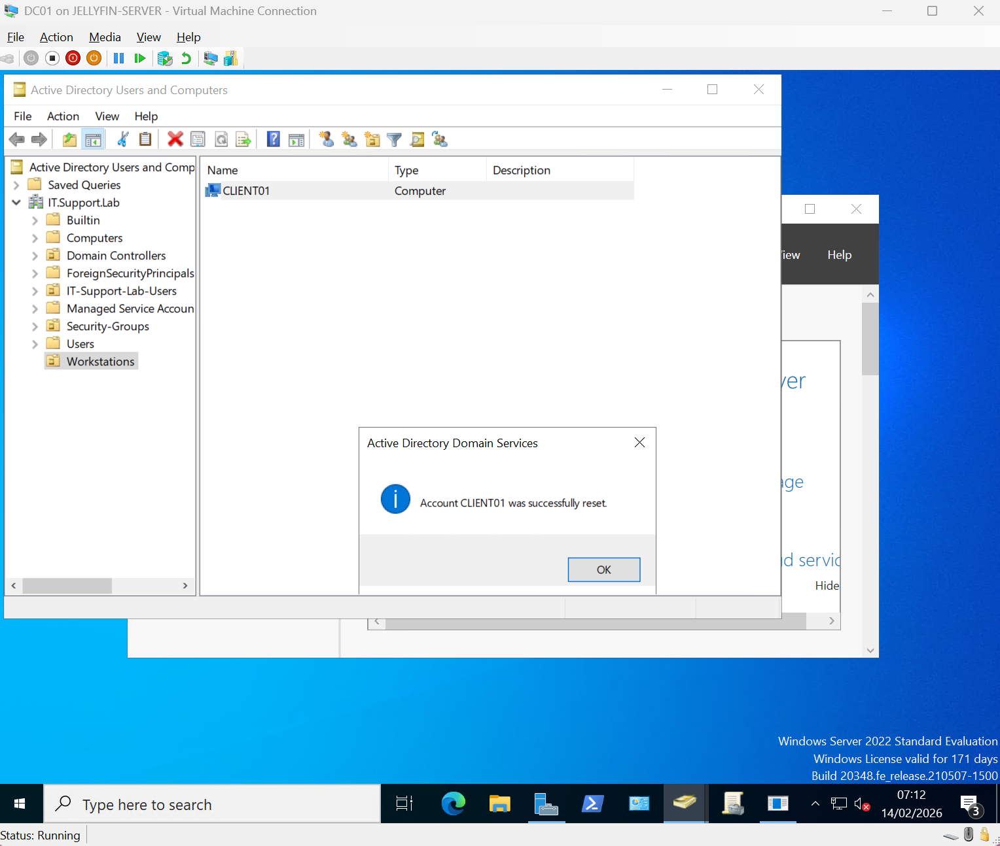
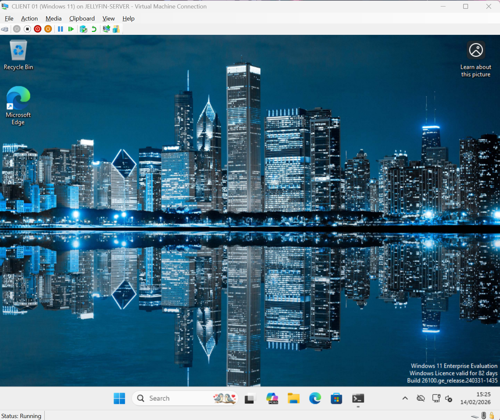

# Day 10 – Broken Trust Relationship Simulation Lab

---

## 🧠 Objective

Simulate and resolve a real-world **Active Directory broken trust relationship** scenario between a domain-joined workstation and the Domain Controller.

This lab demonstrates:

- How trust relationships work in Active Directory
- How they break
- How to identify the error
- How to repair the secure channel
- How to validate successful remediation

---

## 🏗 Lab Environment

**Domain:** IT.Support.Lab  
**Domain Controller:** DC01  
**Client Machine:** CLIENT01 (Windows 11)  
**User Tested:** Mike Tyson  
**Role Used for Fix:** Domain Administrator  

---

## 🚨 Scenario

A remote user (Mike Tyson) reports:

> "I cannot log in to my computer. It says the trust relationship between this workstation and the primary domain failed."

This indicates the secure channel between CLIENT01 and DC01 is broken.

---

# 🔥 Step 1 – Breaking the Trust Relationship (Simulation)

The trust relationship was intentionally broken to simulate a real-world issue.

This can occur due to:

- Machine password mismatch
- Snapshot reversion
- Restoring old backups
- AD replication issues
- Manual machine account manipulation

Screenshot:





---

# ❌ Step 2 – Trust Relationship Error

Attempting to log in as a domain user produces the following error:

> The trust relationship between this workstation and the primary domain failed.

Screenshot:



This confirms:

- Machine account password mismatch
- Secure channel broken
- Authentication to DC failing

---

# 🛠 Step 3 – Fixing the Broken Trust

Logged in locally using Domain Admin credentials.

Repaired the trust relationship by resetting the computer account in Active Directory.

Screenshot:



This resets the machine account password in AD.

---

# 🔐 Step 4 – Signing Into Domain Admin

Logged into CLIENT01 using Domain Administrator credentials to validate connectivity.

Screenshot:



Validation:

- Domain authentication successful
- Secure channel restored
- Communication with DC01 re-established

---

# 👤 Step 5 – Logging Back Into Mike Tyson's Account

User successfully logged back into their domain account.

Screenshot:


Validation command used:

```
whoami
```

Result confirmed:

```
it\mike.tyson
```

This proves:

- Domain authentication restored
- Trust relationship repaired
- Secure channel functioning properly

---

# 🧠 Technical Explanation

Every domain-joined computer has a machine account in Active Directory.

- The machine account has its own password.
- That password automatically rotates every 30 days.
- If the local machine and Domain Controller disagree on this password, the trust breaks.

This creates a secure channel failure.

The repair process resets the machine account password and re-establishes trust.

---

# 🧩 Commands Used

```
whoami
```

Graphical tools used:

- Active Directory Users and Computers
- Computer Account Reset
- Domain Reauthentication

---

# 🏁 Outcome

The following was confirmed:

- Broken trust relationship simulated successfully
- Trust relationship error reproduced
- Machine account reset in Active Directory
- Domain authentication restored
- User access validated

System Status: ✅ Healthy  
Secure Channel: ✅ Restored  
Domain Authentication: ✅ Verified  
User Login: ✅ Functional  

---

# 💼 Helpdesk Portfolio Value

This lab demonstrates real-world Helpdesk / Junior Sysadmin skills:

- Secure channel troubleshooting
- Active Directory machine account management
- Domain authentication validation
- Root cause identification
- Structured remediation workflow
- Post-fix verification process

Broken trust relationships are a very common enterprise support issue.
This lab mirrors real production scenarios.

---

Lab Completed: Day 10  
Focus Area: Active Directory Secure Channel & Trust Relationship Recovery

