# Day 12 – Multi-Department Network Segmentation & Routing Preparation

## 📁 Lab Location

```
Ravi/Labs/IT-Support-Lab/Day-12-Multi-Department-DHCP-Scopes/
```

---

# 🧱 Stage 1 – Create Internal Virtual Switches

Created two new internal virtual switches in Hyper-V:

- `Lab_Sales_Internal`
- `Lab_Finance_Internal`

These switches simulate isolated departmental LAN segments.

## 📸 Screenshots

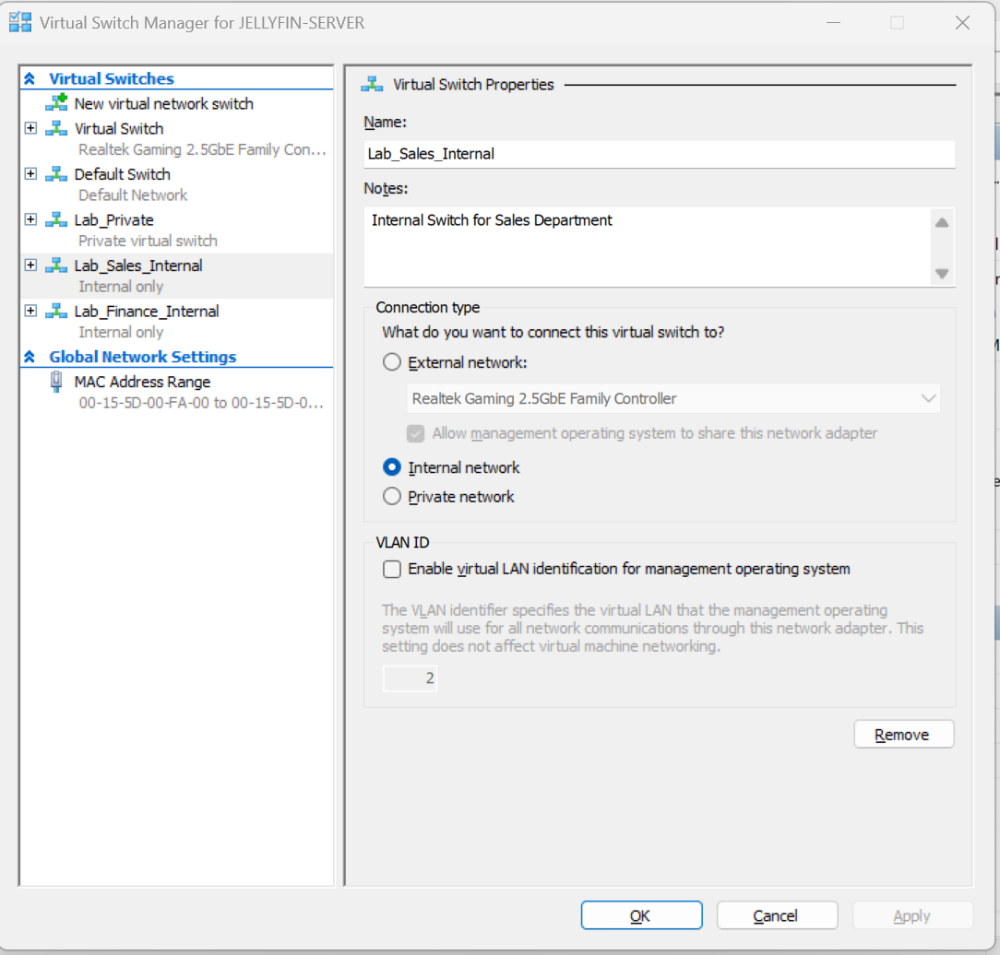

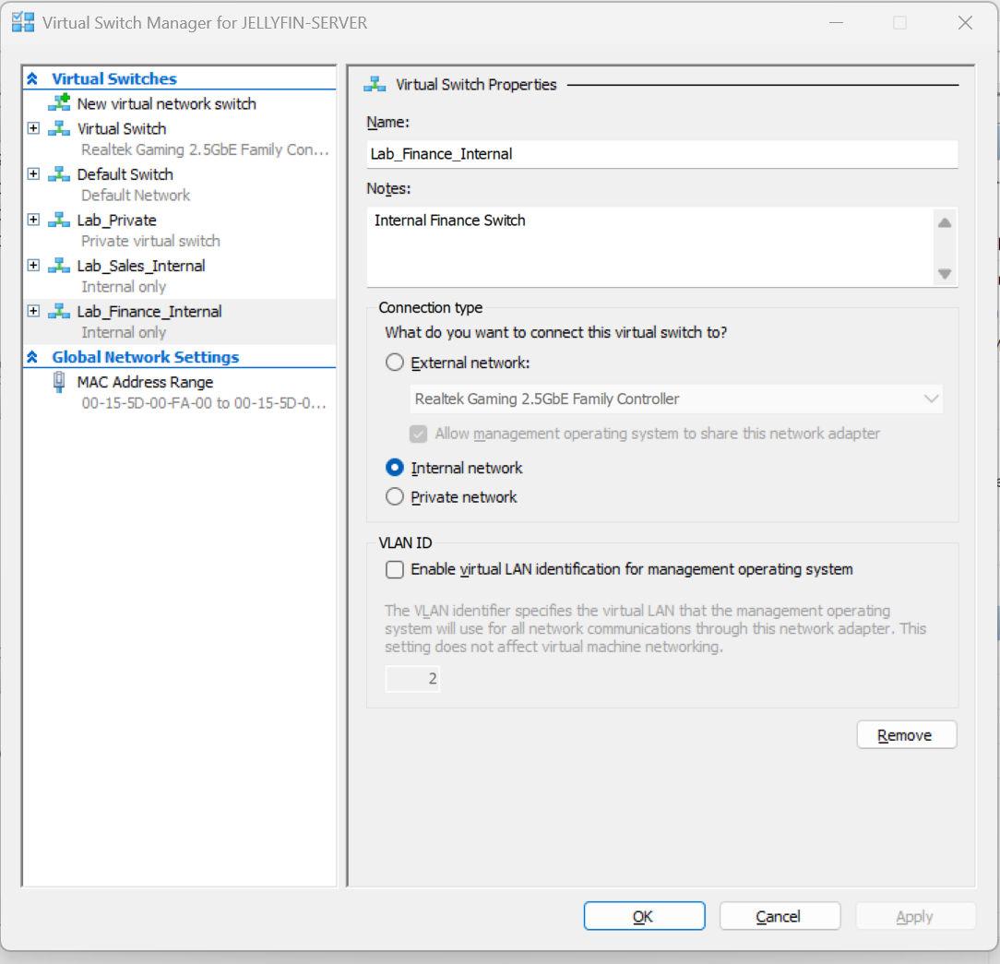

---

# 🔌 Stage 2 – Add Department Switches to DC01

Added additional network adapters to DC01:

- Connected one adapter to `Lab_Sales_Internal`
- Connected one adapter to `Lab_Finance_Internal`

DC01 is now multi-homed.

## 📸 Screenshots

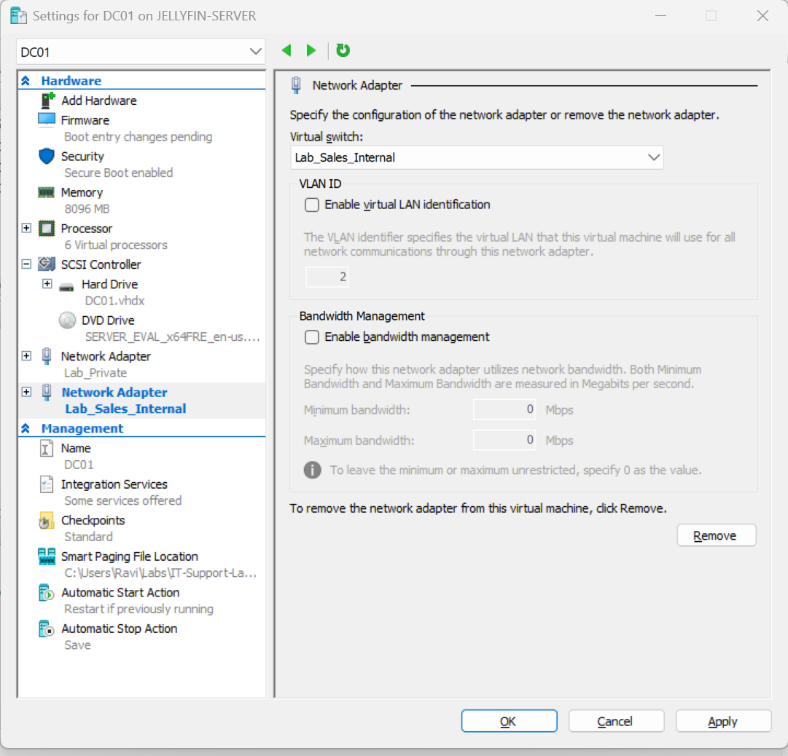

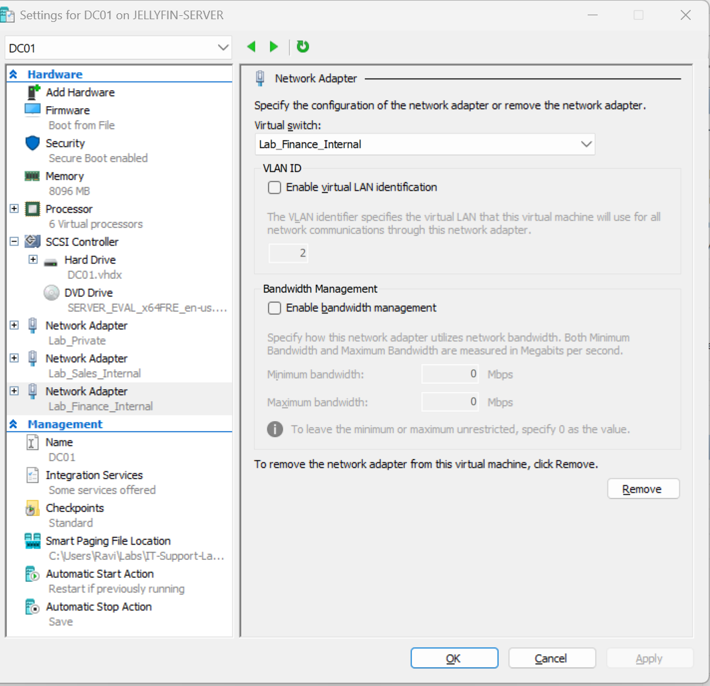

---

# 🏷️ Stage 3 – Rename Network Adapters on DC01

Renamed adapters for clarity:

- `Helpdesk_Net`
- `Sales_Net`
- `Finance_Net`

## 📸 Screenshot

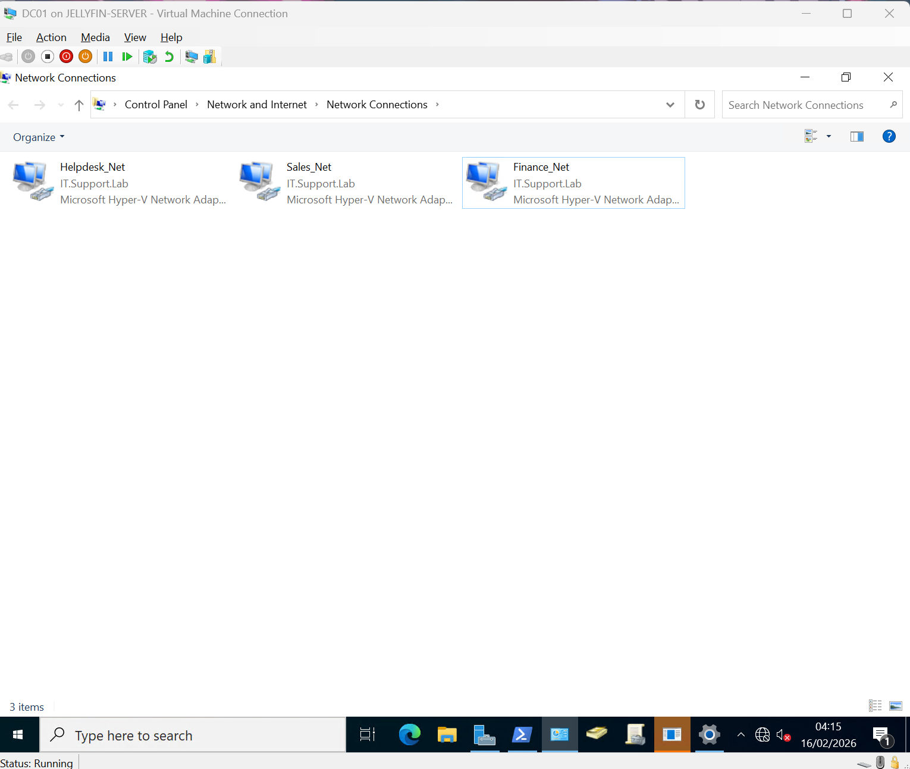

---

# 🌐 Stage 4 – Configure Static IP Addresses

Configured static IP addresses for each departmental subnet.

---

## 🟢 Sales Network Configuration

```bash
IP Address: 192.168.20.10
Subnet Mask: 255.255.255.0
Default Gateway: (blank)
DNS Server: 192.168.10.10
```

### 📸 Screenshot

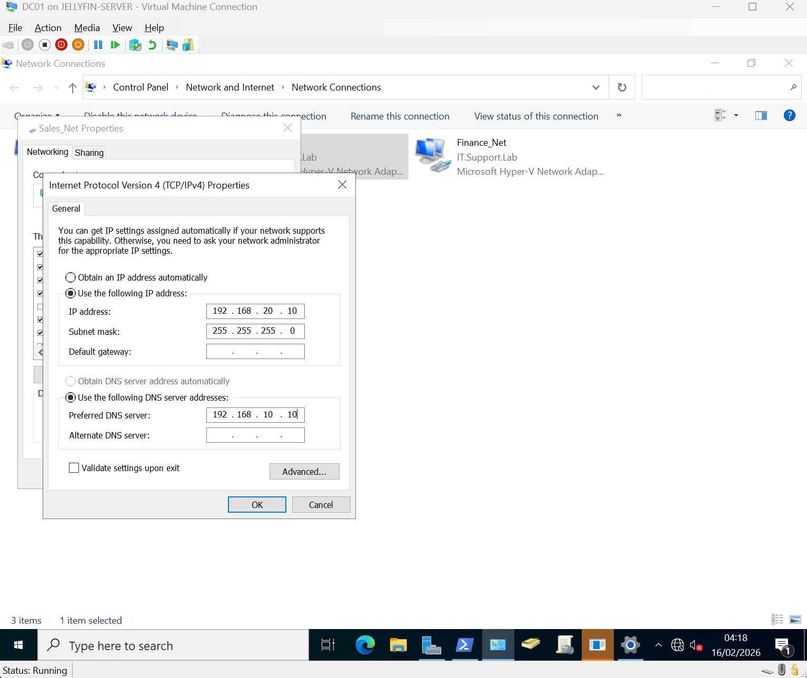

---

## 🔵 Finance Network Configuration

```bash
IP Address: 192.168.30.10
Subnet Mask: 255.255.255.0
Default Gateway: (blank)
DNS Server: 192.168.10.10
```

### 📸 Screenshot

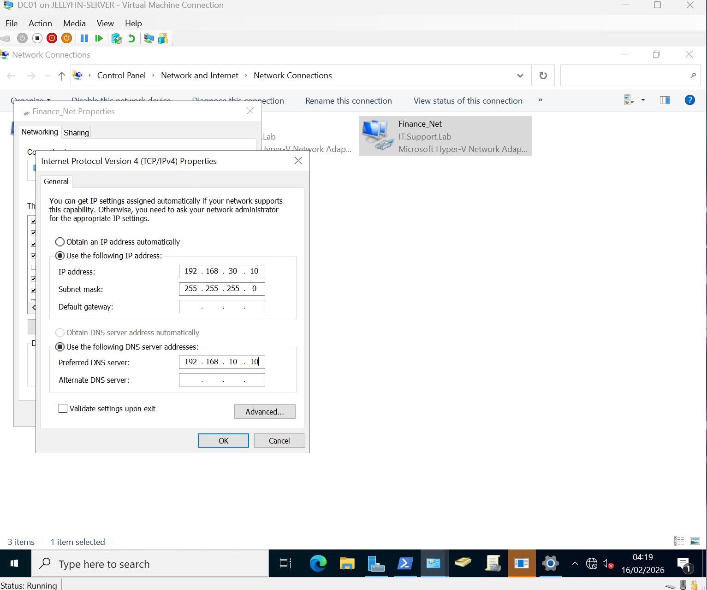

---

# 🔎 Stage 5 – Verify Multi-NIC Configuration

Verified all network adapters using:

```bash
ipconfig
```

Confirmed:

- Helpdesk → 192.168.10.10  
- Sales → 192.168.20.10  
- Finance → 192.168.30.10  

## 📸 Screenshot

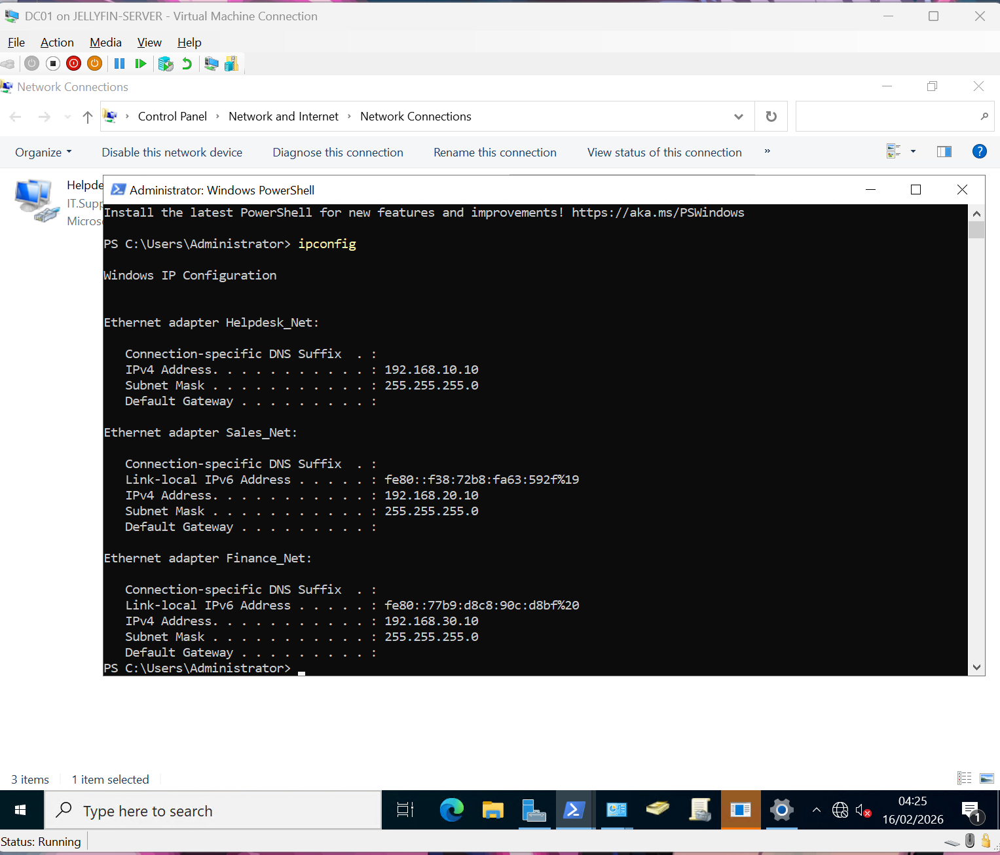

---

# 🚦 Stage 6 – Install Routing Role

Installed Routing role on Windows Server.

```bash
Install-WindowsFeature Routing -IncludeManagementTools
```

## 📸 Screenshot

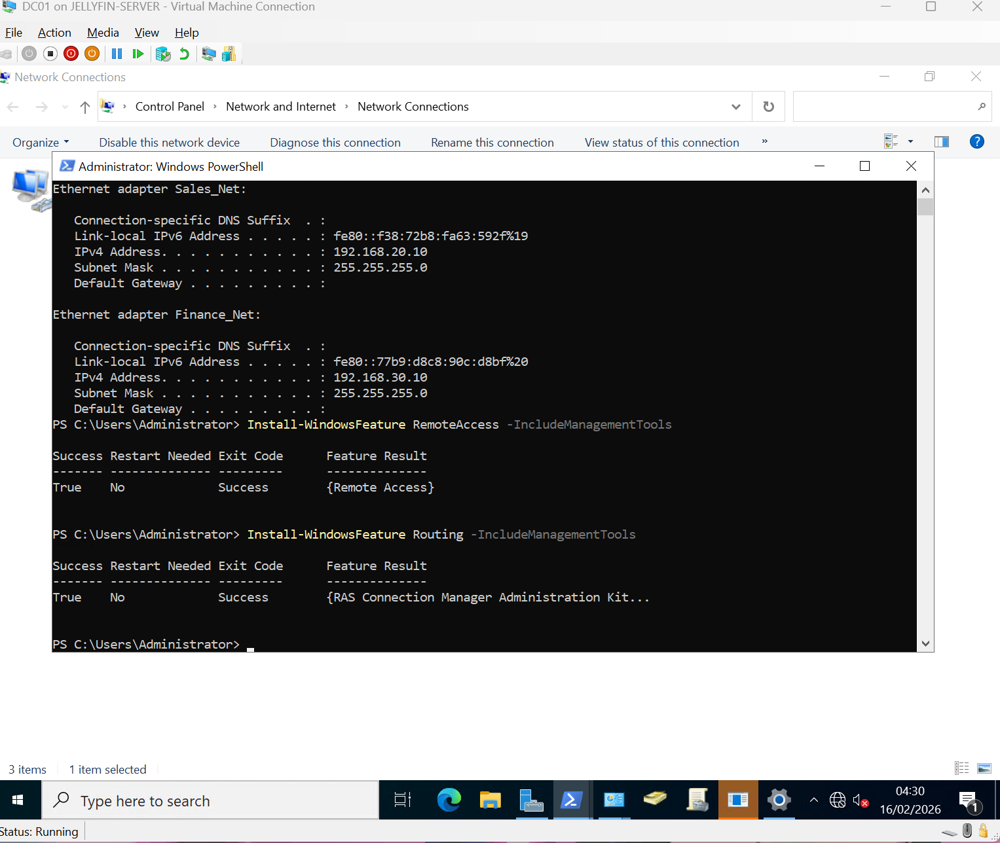

---

# 🔁 Stage 7 – Enable IP Routing (RRAS)

Enabled routing functionality and IP forwarding.

```bash
Install-RemoteAccess -VpnType RoutingOnly
```

```bash
Set-Service RemoteAccess -StartupType Automatic
```

```bash
Start-Service RemoteAccess
```

```bash
Set-ItemProperty -Path "HKLM:\SYSTEM\CurrentControlSet\Services\Tcpip\Parameters" `
-Name IPEnableRouter `
-Value 1
```

## 📸 Screenshots

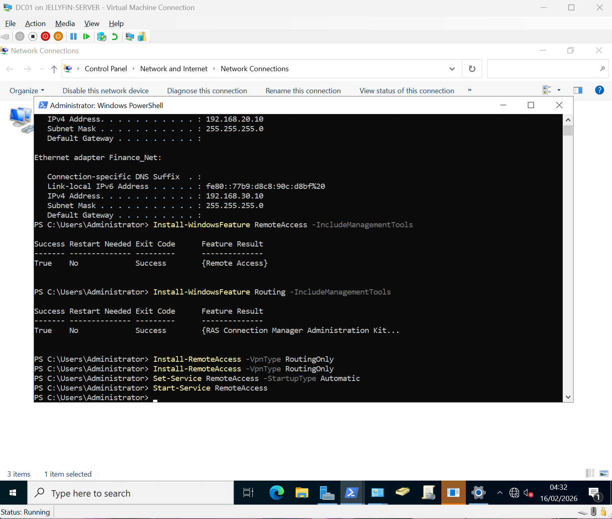

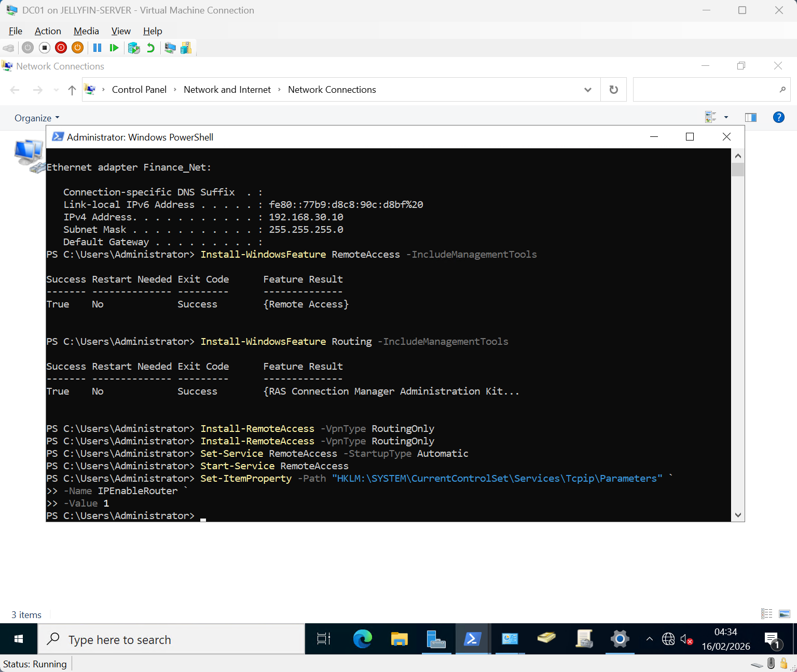

---

# 🧠 Network Architecture Overview

## Subnets

| Department | Subnet | DC01 IP |
|------------|--------|----------|
| Helpdesk | 192.168.10.0/24 | 192.168.10.10 |
| Sales | 192.168.20.0/24 | 192.168.20.10 |
| Finance | 192.168.30.0/24 | 192.168.30.10 |

DC01 is now acting as:

- Domain Controller  
- DNS Server  
- DHCP Server  
- Software Router (RRAS)  

---

# 🎯 Next Steps (Day 13)

- Deploy Sales VM  
- Deploy Finance VM  
- Assign correct default gateway per subnet:
  - Sales → 192.168.20.10  
  - Finance → 192.168.30.10  
- Validate inter-subnet communication  
- Test DNS resolution across subnets  
- Capture routing validation screenshots  

---

# 🔥 Summary

Day 12 transitioned the lab from a single-subnet environment to a segmented multi-subnet architecture.

This lab demonstrates:

- Multi-homed Windows Server configuration  
- Internal network segmentation  
- Subnet boundary implementation  
- Layer 3 routing using RRAS  
- Enterprise-style departmental network design  
