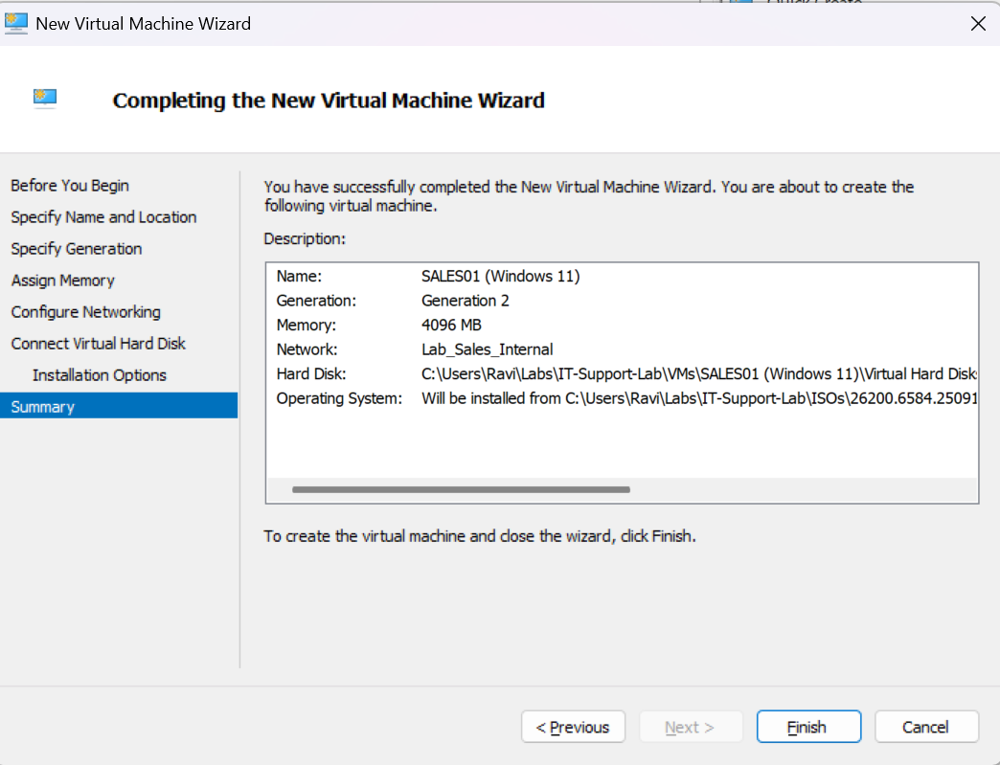
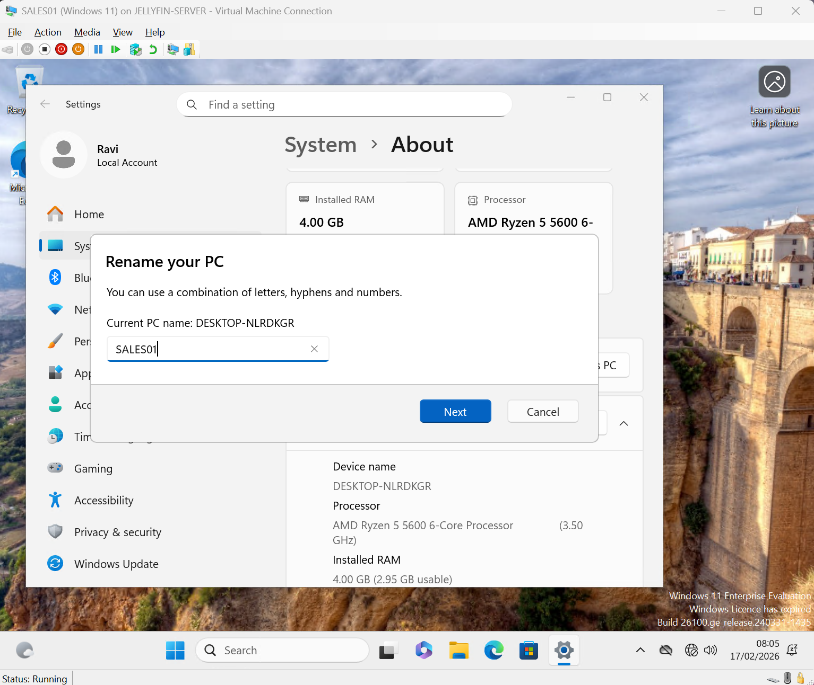
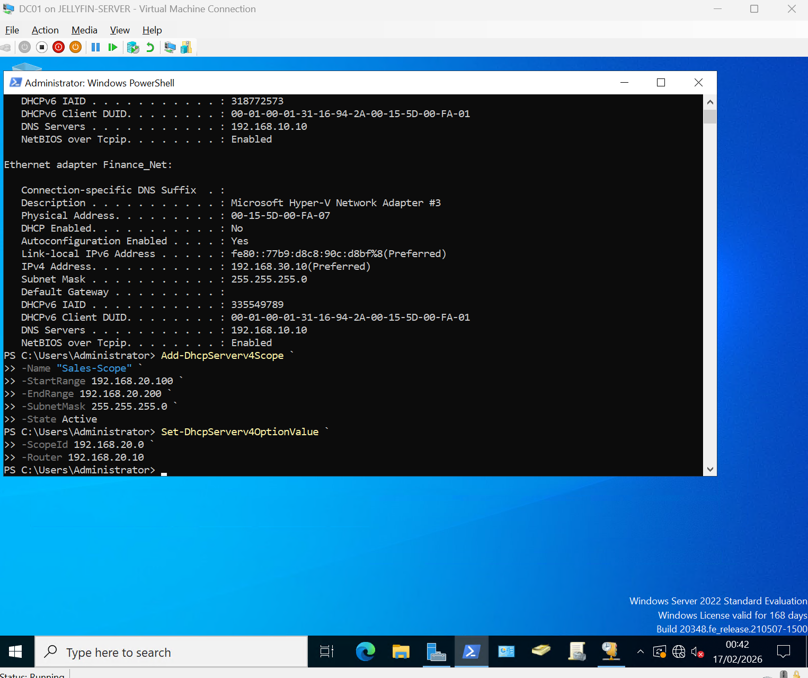
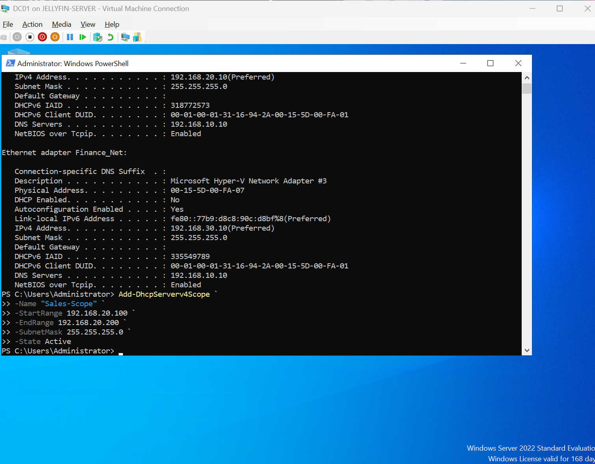
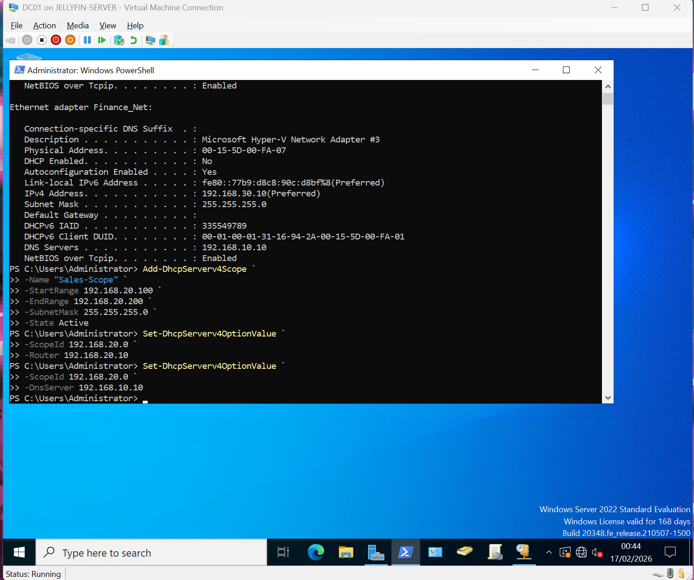
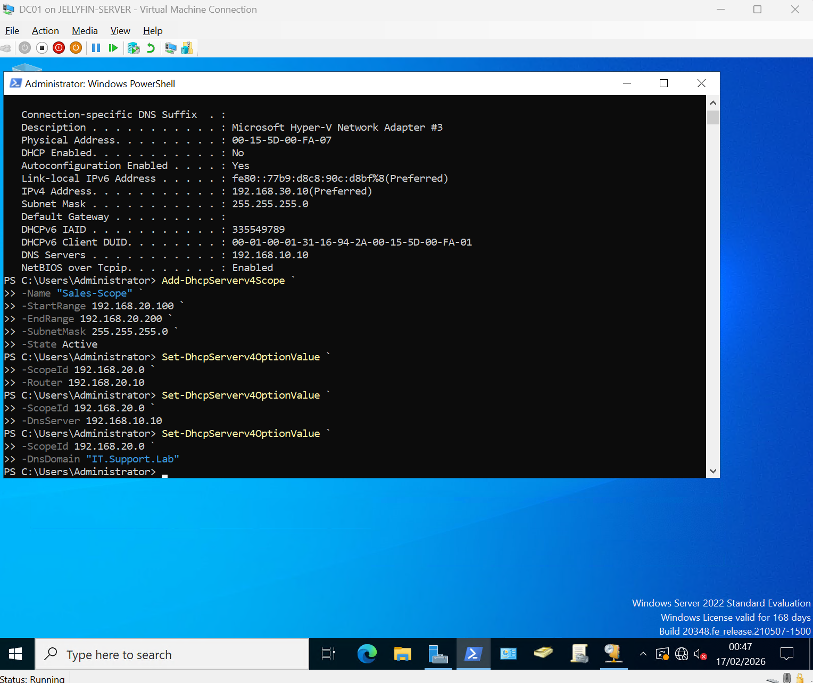
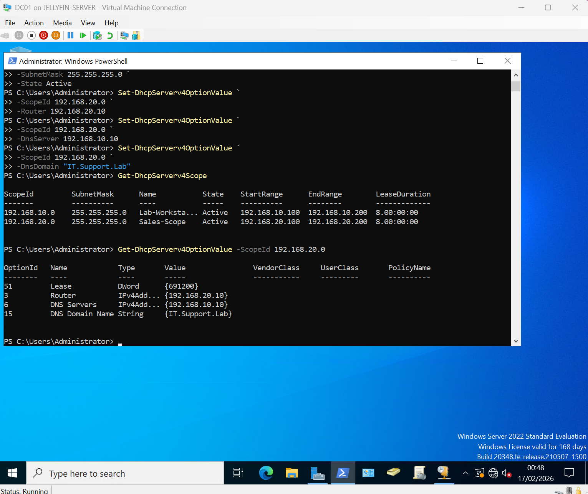
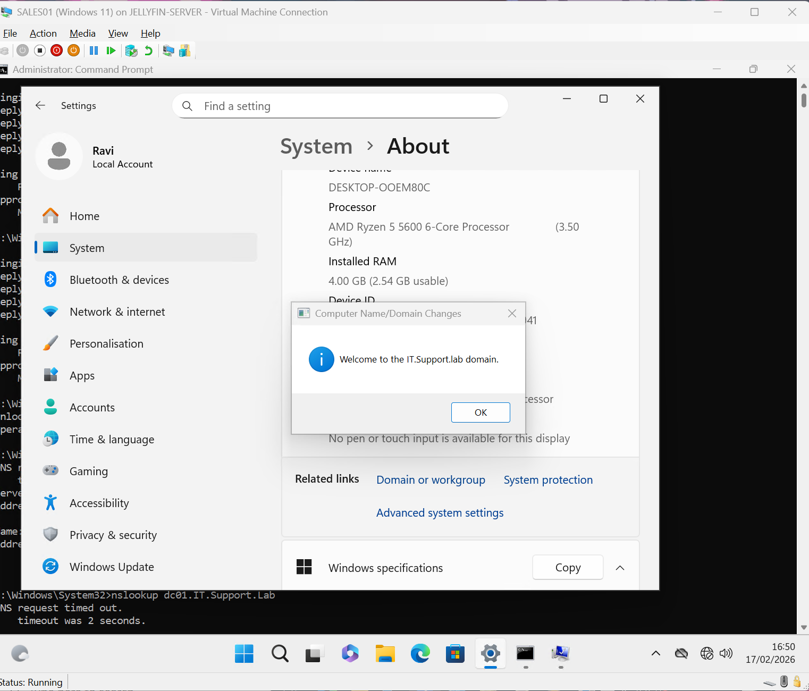
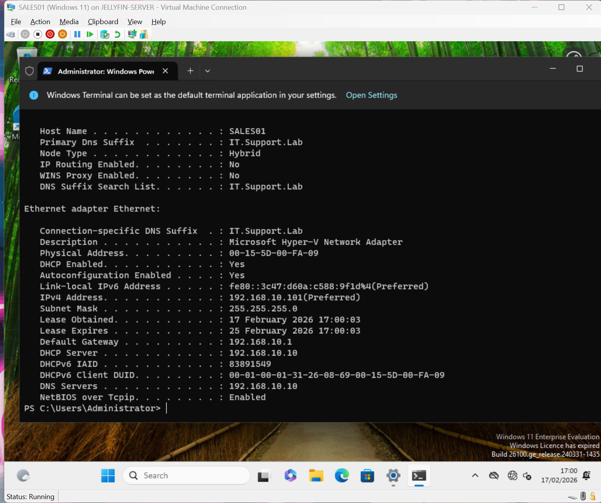

# Day 13 – Multi-Subnet Domain Join & DHCP Validation

## 🧠 Objective

- Configure Sales DHCP scope
- Validate DNS resolution
- Join SALES01 to IT.Support.Lab
- Troubleshoot multi-switch routing issue
- Implement correct OU structure

---

# 🖼️ Lab Walkthrough (Screenshots)

---

## 1️⃣ Create Sales Machine



---

## 2️⃣ Rename Sales Machine



---

## 3️⃣ Create Default Gateway on DC01



---

## 4️⃣ Create Sales DHCP Scope on DC01



---

## 5️⃣ Configure DNS Server IP on DC01



---

## 6️⃣ Configure DNS Name on DC01



---

## 7️⃣ Verify DC01 Configuration



---

## 8️⃣ Join SALES01 to Domain



---

## 9️⃣ SALES01 Receives DHCP Lease



---

## 🔟 Move SALES01 to Workstations OU


---

# ✅ Validation Commands Used

```bash
ipconfig /all
ping 192.168.10.10
ping dc01
nslookup IT.Support.Lab
nslookup dc01.IT.Support.Lab
```

---

# 🏁 Final Result

- SALES01 successfully joined IT.Support.Lab
- DHCP lease automatically assigned
- DNS resolving correctly
- Machine placed inside Workstations OU
- Lab environment stabilised

---

# 📚 Key Learning

Active Directory depends heavily on DNS.

If DNS breaks:
- Domain join fails
- Authentication fails
- Group Policy fails

Infrastructure chain:

Routing → DHCP → DNS → Active Directory → Policy

---


