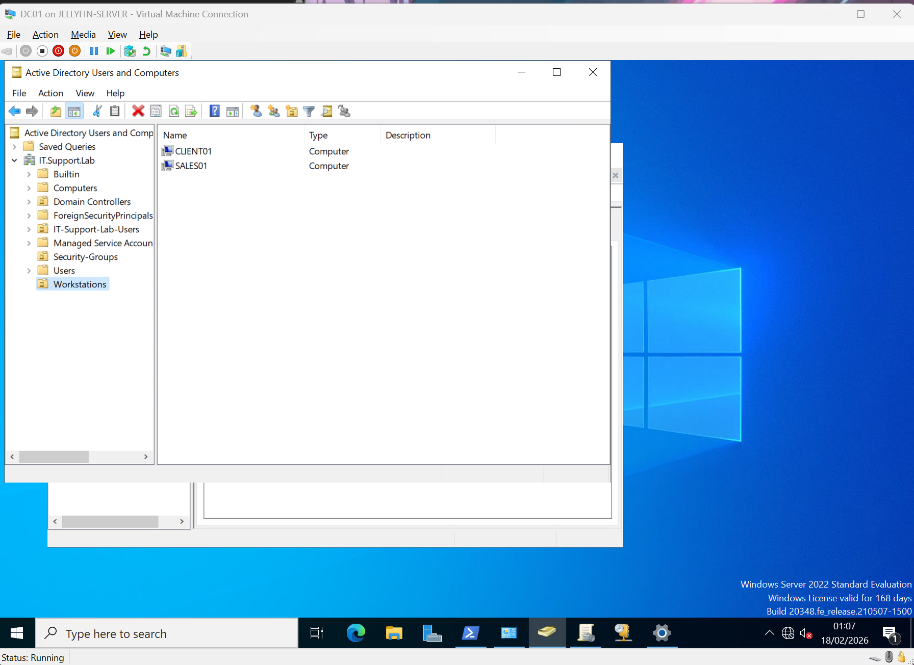
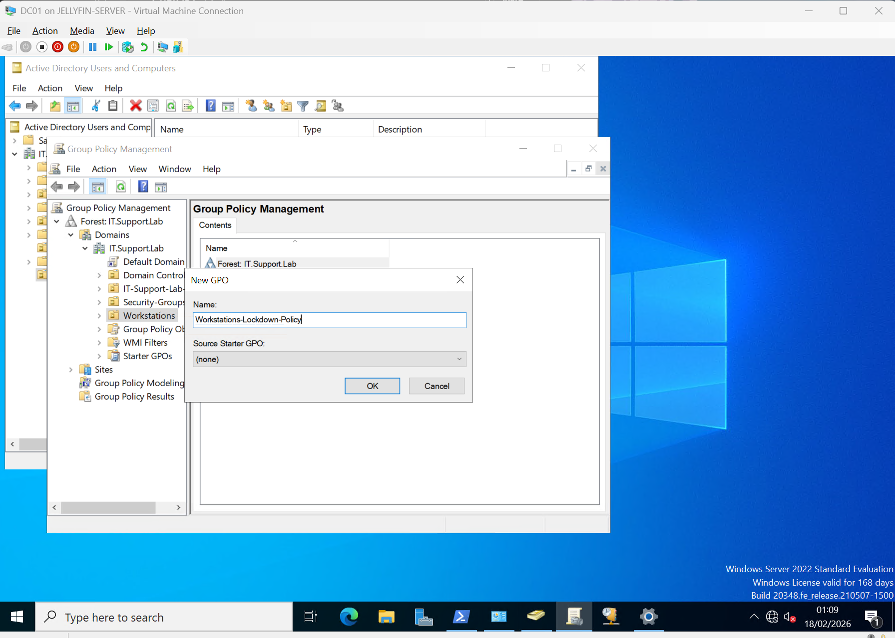
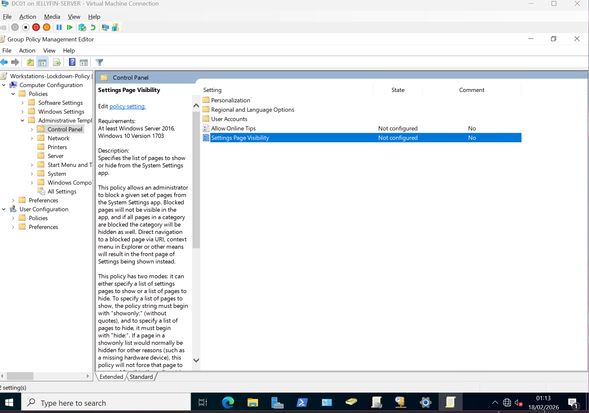
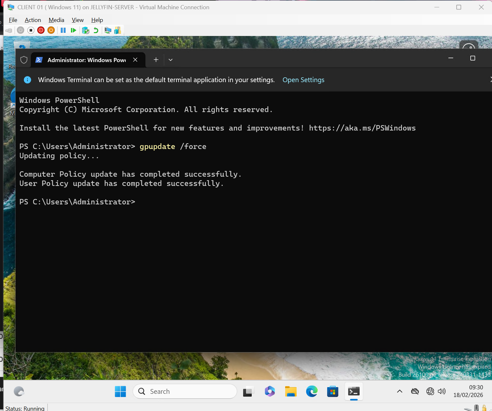
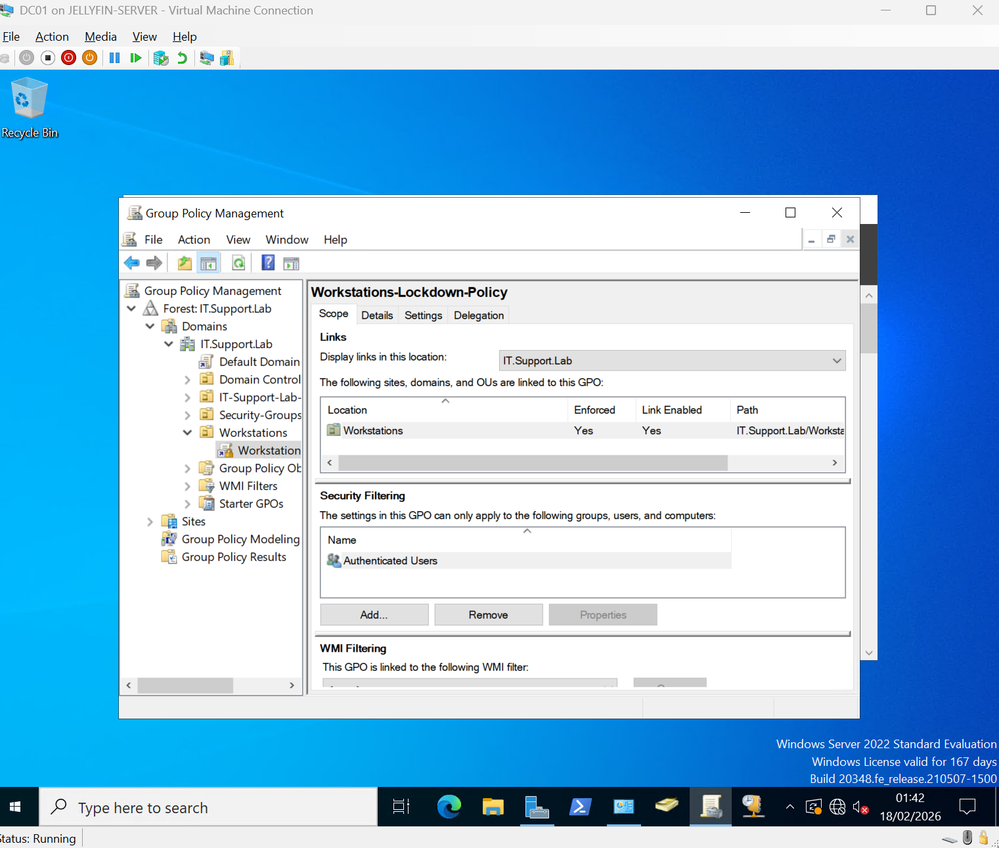
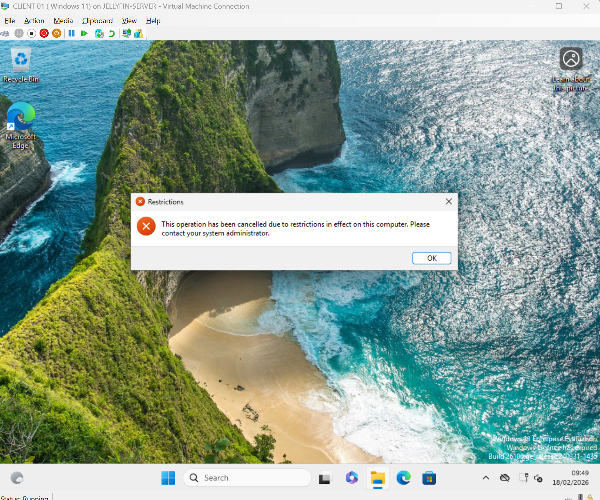
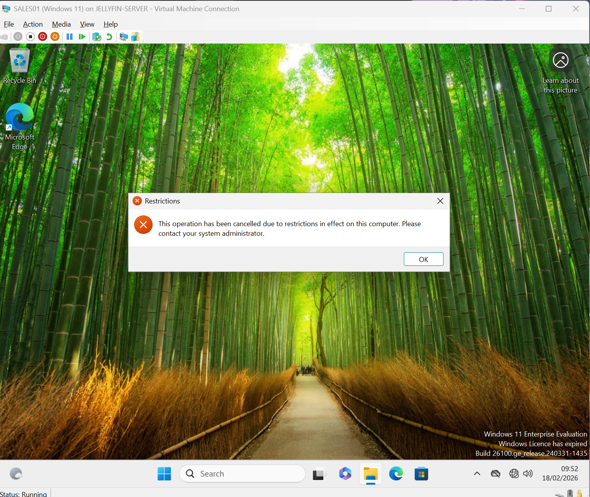

# Day 14 – Group Policy Deployment (Workstations OU)

## 🎯 Objective

Deploy and enforce a Group Policy Object (GPO) to the **Workstations OU** in order to restrict access to:

- Control Panel  
- PC Settings  

This lab demonstrates centralized policy enforcement using Active Directory Group Policy Management.

---

## 🏗️ Environment

- **Domain Controller:** DC01  
- **Domain:** IT.Support.Lab  
- **Client Machines:**  
  - CLIENT01 (Windows 11)  
  - SALES01 (Windows 11)  
- **Target OU:** Workstations  

---

## 🗂️ OU Structure

The Workstations OU contains domain-joined client machines that should receive centralized workstation policies.



---

## 🛠️ Step 1 – Create New GPO

A new GPO was created and linked to the **Workstations OU**.

GPO Name:
```
Workstations-Lockdown-Policy
```



---

## 🔐 Step 2 – Configure Policy Setting

Navigated to:

```
User Configuration
 └── Policies
     └── Administrative Templates
         └── Control Panel
```

Enabled:

```
Prohibit access to Control Panel and PC settings
```




---

## 🔄 Step 3 – Force Group Policy Update

On CLIENT01:

```
gpupdate /force
```



On SALES01:

```
gpupdate /force
```


---

## 📌 Step 4 – Enforce GPO

The GPO was enforced at the OU level to ensure mandatory application.



---

## ✅ Step 5 – Validation

Attempted to open Control Panel and Settings on both machines.

Result:

> "This operation has been cancelled due to restrictions in effect on this computer."

### CLIENT01



### SALES01



---

## 🧠 What This Demonstrates

- OU-based policy targeting
- Centralized workstation control
- Administrative Template configuration
- GPO processing on domain clients
- Policy enforcement validation
- Enterprise-style security hardening

---

## 📚 Key Takeaways

- GPOs allow administrators to manage large environments centrally.
- Linking policies to OUs enables granular control.
- Enforcement ensures policies cannot be overridden by lower-precedence policies.
- Always validate with `gpupdate /force` and real user-side testing.

---

## 🚀 Progression

This lab builds on:

- Domain Join validation  
- DHCP configuration  
- OU structuring  
- Active Directory object management  

The environment now supports real-world enterprise policy deployment scenarios.

---

**Next Steps (Future Labs):**
- GPO filtering using security groups
- Testing policy precedence and inheritance
- Using `gpresult /r` for reporting
- Deploying desktop wallpaper policies
- Password and account lockout policies
