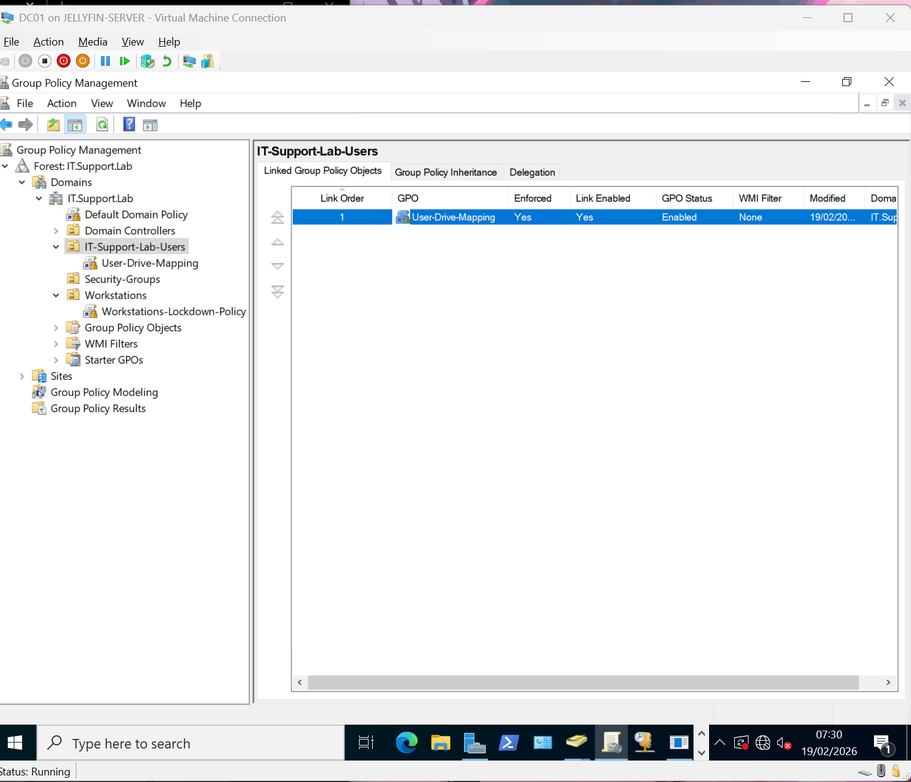
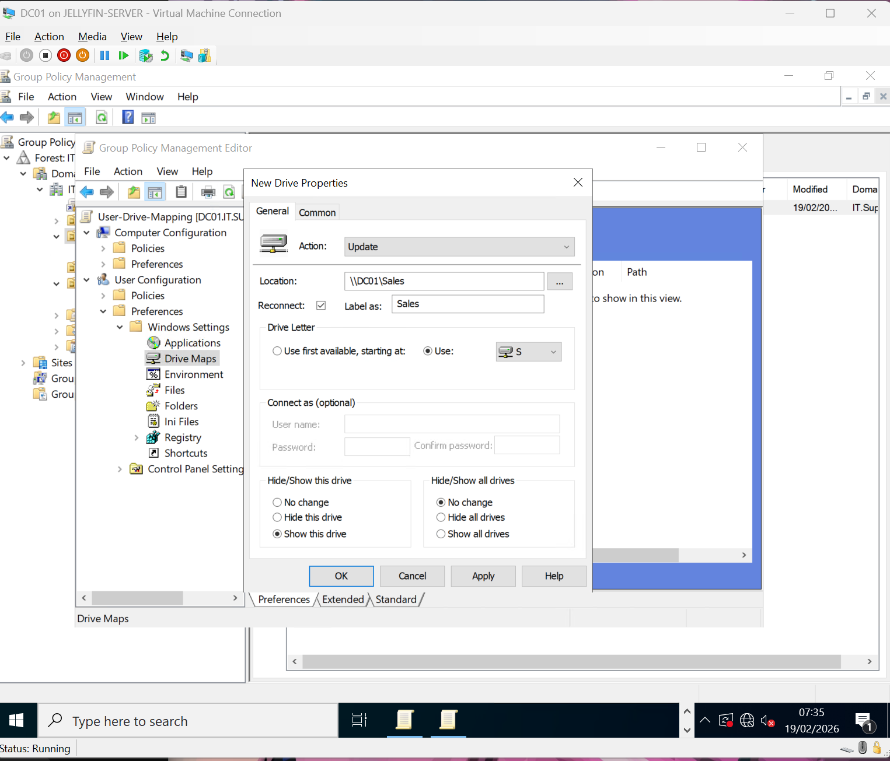
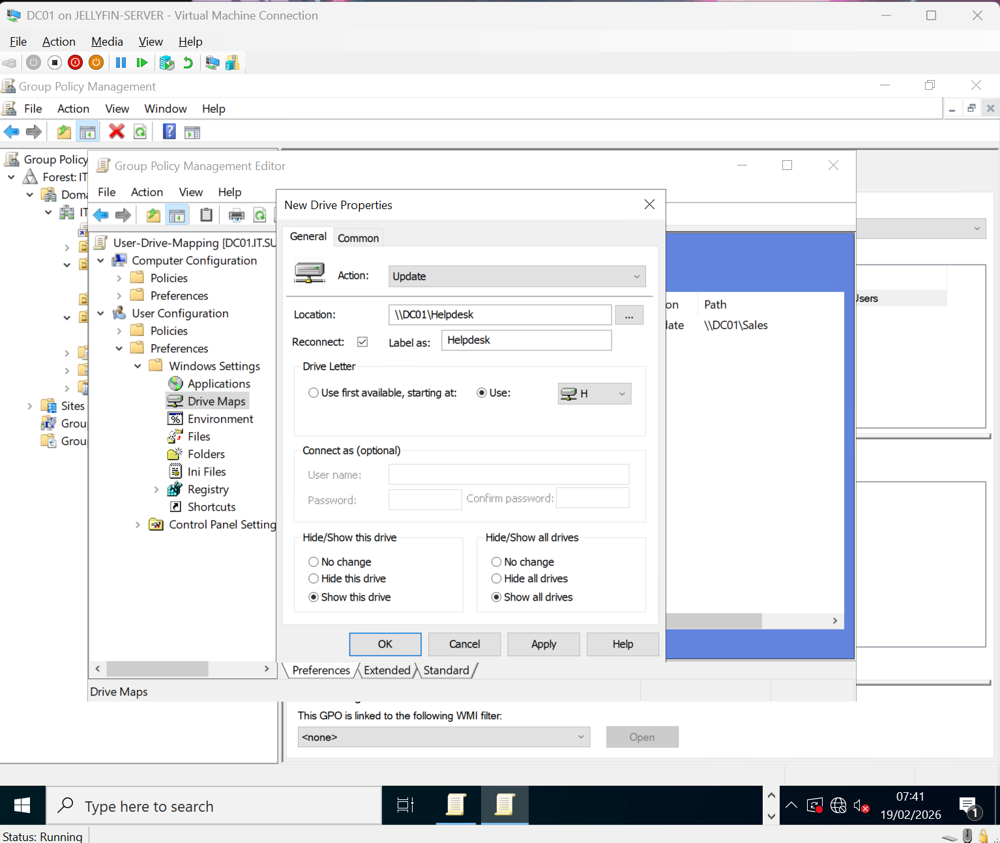
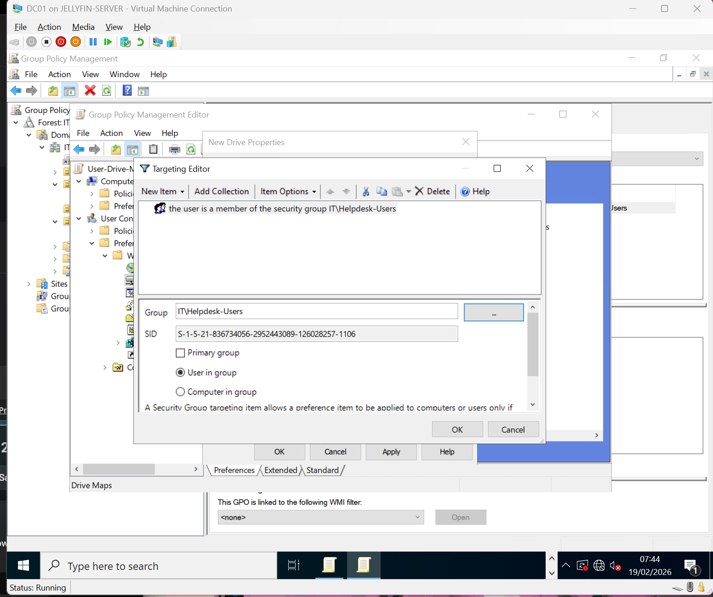
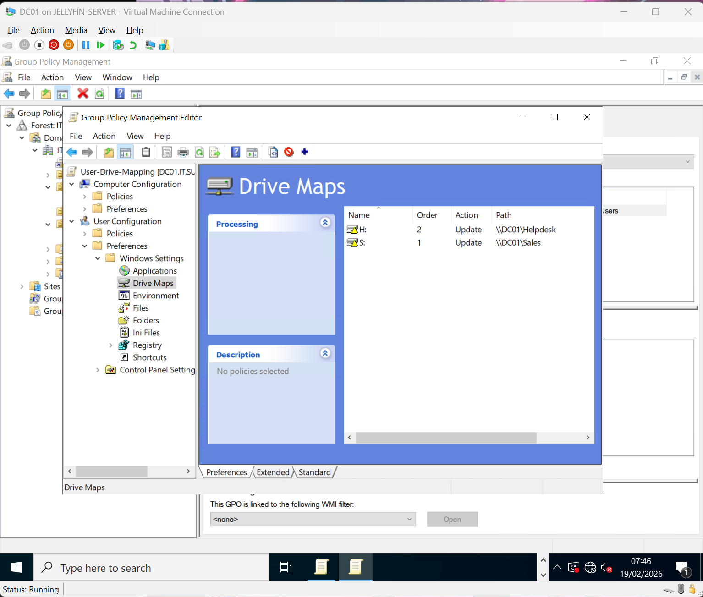
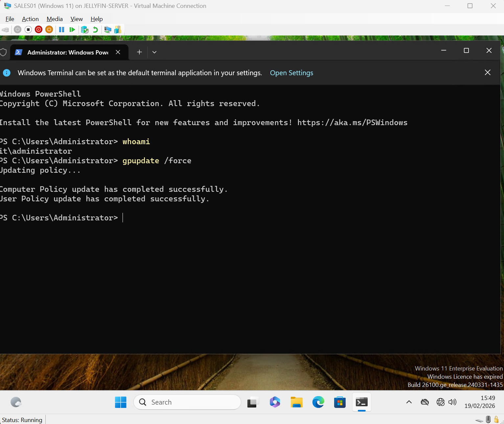
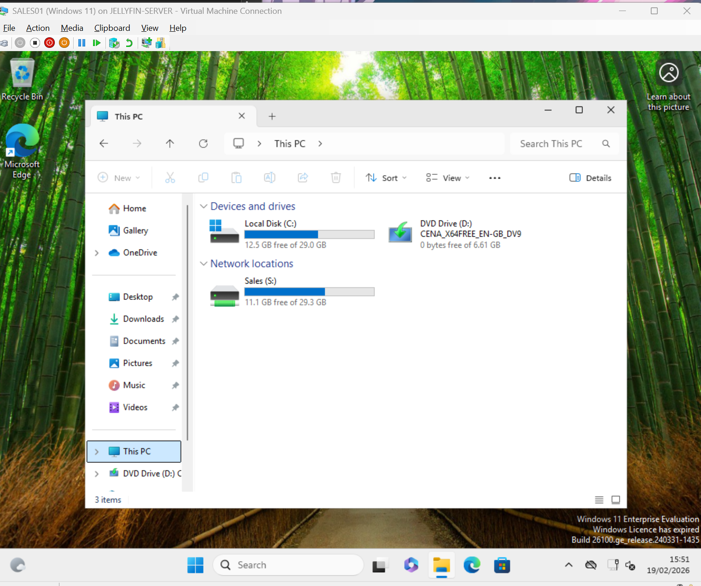
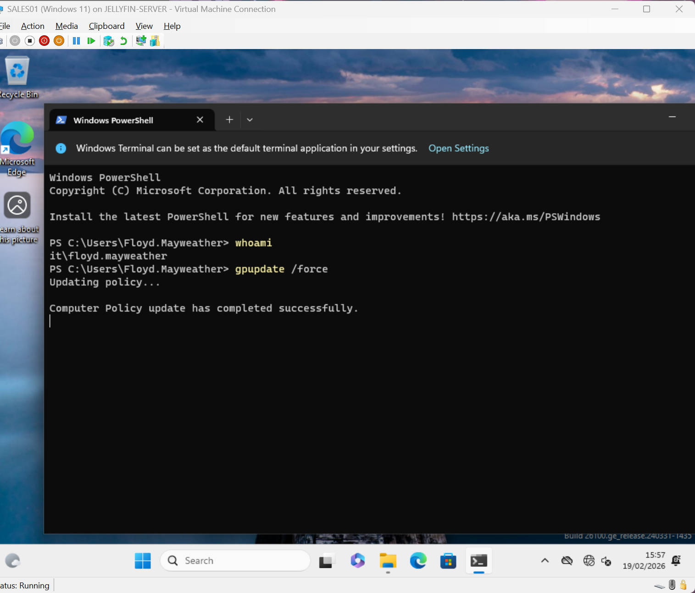
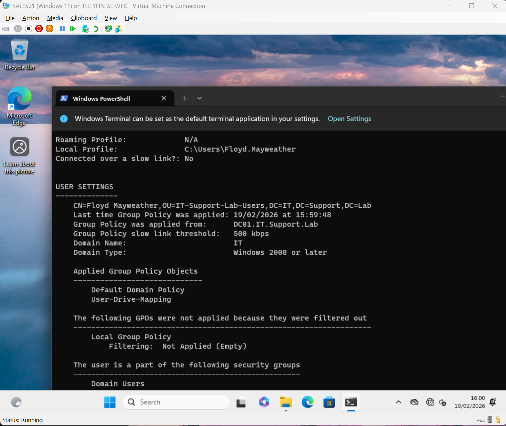

# Day 15 – Role-Based Drive Mapping Using Security Groups

## 🎯 Objective

Implement Role-Based Access Control (RBAC) using Active Directory Security Groups and Group Policy Preferences to automatically map network drives based on user group membership.

This lab ensures:

- Sales users automatically receive the Sales drive (S:)
- Helpdesk users automatically receive the Helpdesk drive (H:)
- Access is determined by identity, not by computer
- Default Domain Policy remains untouched (best practice)

---

## 🏗️ Environment

- **Domain Controller:** DC01  
- **Domain:** IT.Support.Lab  
- **Client Machines:**  
  - CLIENT01 (Windows 11)  
  - SALES01 (Windows 11)  
- **Users OU:** IT-Support-Lab-Users  
- **Security Groups:**  
  - IT\Sales-Users  
  - IT\Helpdesk-Users  

---

## 🗂️ Shared Folder Configuration

The following shared folders exist on DC01:

- `\\DC01\Sales`
- `\\DC01\Helpdesk`

NTFS permissions are aligned with corresponding security groups to enforce least privilege access.

---

## 🛠️ Step 1 – Create User Drive Mapping GPO

A new GPO was created and linked to the **IT-Support-Lab-Users OU**.

GPO Name:

User-Drive-Mapping

---

## 🗂️ Step 2 – Configure Sales Drive Mapping

Navigated to:

User Configuration
└── Preferences
└── Windows Settings
└── Drive Maps

Created a new mapped drive with the following settings:

- Action: Update
- Location: `\\DC01\Sales`
- Drive Letter: S:
- Reconnect: Enabled

Enabled **Item-Level Targeting**.

Target condition:

- User is a member of security group → `IT\Sales-Users`

---

## 🗂️ Step 3 – Configure Helpdesk Drive Mapping

Created a second mapped drive:

- Action: Update
- Location: `\\DC01\Helpdesk`
- Drive Letter: H:
- Reconnect: Enabled

Enabled **Item-Level Targeting**.

Target condition:

- User is a member of security group → `IT\Helpdesk-Users`

Final GPO configuration:

---

## 🔄 Step 4 – Force Group Policy Update (Sales User)

Logged into SALES01 as **Muhammad Ali** (member of IT\Sales-Users).

Executed:

gpupdate /force

Result:

- S: drive mapped automatically
- H: drive not present

---

## 🔄 Step 5 – Force Group Policy Update (Helpdesk User)

Logged into SALES01 as **Floyd Mayweather** (member of IT\Helpdesk-Users).

Executed:

gpupdate /force

Result:

- H: drive mapped automatically
- S: drive not present

---

## 🔎 Validation

Used:

gpresult /r

Confirmed:

- User-Drive-Mapping GPO successfully applied
- Correct security group membership detected
- No filtering or processing errors

---

## 🧠 What This Demonstrates

- Active Directory Security Group management
- Role-Based Access Control (RBAC)
- Group Policy Preferences (Drive Maps)
- Item-Level Targeting
- Proper GPO scoping to Users OU
- Identity-based resource access
- Enterprise best practice (no modification of Default Domain Policy)

---

## 📚 Key Takeaways

- Drive mapping should be based on identity, not device.
- Security groups provide scalable access control.
- Group Policy Preferences allow flexible targeting without complex scripting.
- Always validate with `gpupdate /force` and `gpresult /r`.
- RBAC simplifies management and improves security posture.

---

## 🚀 Progression

This lab builds on:

- Domain join validation  
- DHCP configuration  
- OU structuring  
- Security group management  
- NTFS permission alignment  
- Previous GPO deployment labs  

