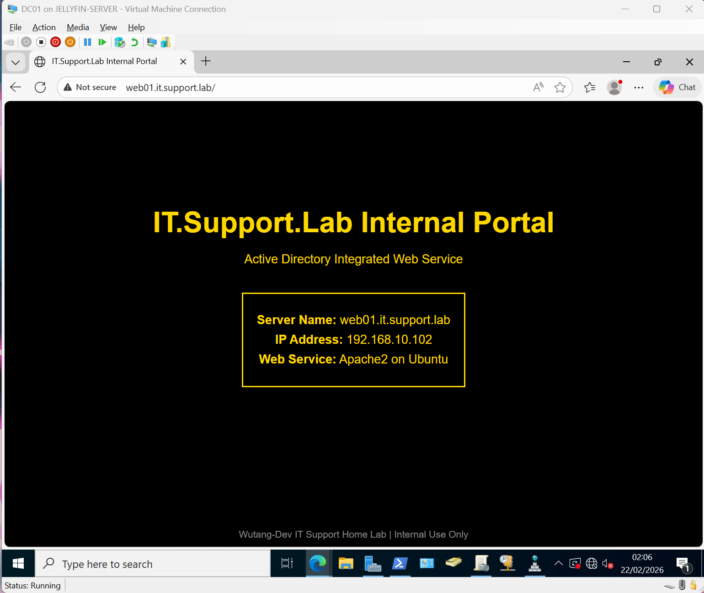

# Day 18 – Replacing Default Apache Page with Internal AD-Integrated Portal

## 🎯 Objective

Replace the default Apache2 Ubuntu page with a custom internal company portal, accessed via Active Directory integrated DNS.

This builds on Day 17 where the internal DNS A record `web01.it.support.lab` was created.

---

## 🛠 Actions Taken

### 1️⃣ Remote Administration via SSH

```bash
ssh username@192.168.10.102
```

Using SSH reflects real-world enterprise server management practices.

---

### 2️⃣ Backed Up Default Apache Page

Before making changes, created a backup of the default page:

```bash
sudo cp /var/www/html/index.html /var/www/html/index.html.bak
```

---

### 3️⃣ Replaced Default Page with Internal Portal

Overwrote the existing file using a heredoc:

```bash
sudo tee /var/www/html/index.html > /dev/null << 'EOF'
<!DOCTYPE html>
<html>
<head>
    <title>IT.Support.Lab Internal Portal</title>
    <meta charset="UTF-8">
    <style>
        body {
            margin: 0;
            padding: 0;
            background-color: #000000;
            font-family: Arial, sans-serif;
            color: #FFD700;
            text-align: center;
        }
        .container {
            margin-top: 15%;
        }
        h1 {
            font-size: 42px;
            margin-bottom: 20px;
        }
        p {
            font-size: 18px;
            margin: 8px 0;
        }
        .server-box {
            margin-top: 30px;
            padding: 20px;
            border: 2px solid #FFD700;
            display: inline-block;
        }
        footer {
            position: fixed;
            bottom: 10px;
            width: 100%;
            font-size: 14px;
            color: #888;
        }
    </style>
</head>
<body>
    <div class="container">
        <h1>IT.Support.Lab Internal Portal</h1>
        <p>Active Directory Integrated Web Service</p>
        <div class="server-box">
            <p><strong>Server Name:</strong> web01.it.support.lab</p>
            <p><strong>IP Address:</strong> 192.168.10.102</p>
            <p><strong>Web Service:</strong> Apache2 on Ubuntu</p>
        </div>
    </div>
    <footer>
        Wutang-Dev IT Support Home Lab | Internal Use Only
    </footer>
</body>
</html>
EOF
```

---

### 4️⃣ Restarted Apache Service

```bash
sudo systemctl restart apache2
```

---

### 5️⃣ Validation

Accessed the portal using the internal DNS hostname:

```
http://web01.it.support.lab
```
Confirmed:

- DNS resolution functioning correctly  
- Apache service operational  
- Hostname-based access working  
- No dependency on direct IP address  

---


## 📸 Result



The Ubuntu web server is now operating as a controlled internal service fully integrated with Active Directory DNS.

---

## 🧠 Key Learning Points

- Default service pages should be replaced in enterprise environments  
- Services should be validated using DNS names rather than IP addresses  
- SSH-based remote administration mirrors real-world infrastructure management  
- Internal services rely heavily on properly configured DNS  

---


## ✅ Outcome

The IT Support Lab now includes a DNS-integrated internal web service with custom branding, remote administration practices, and hostname-based validation.
